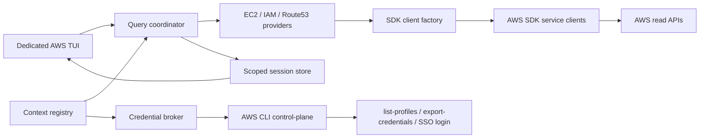
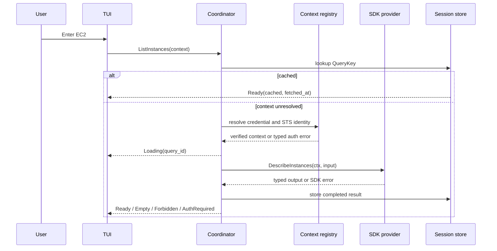

# AWS Browse v2 Architecture: SDK data-plane과 제한된 cross-profile query

독자        저장소 소유자와 구현·검토 담당자
목적        category-first AWS TUI의 data flow, credential 경계, 동시성, cache, 오류·검증 계약을 고정한다
대상 환경   Go 1.25, Bubble Tea v2, AWS SDK for Go v2, AWS CLI v2, 여러 named profile
최종 검토   2026-08-27
다음 검토   credential·security spike 완료 시
상태        Hybrid access 기준안 확정, 구현 미착수

관련 문서   [PRD](PRD.md) · [설계](DESIGN.md) · [동작 시나리오](SCENARIOS.md) · [ADR-001](ADR-001-HYBRID-AWS-ACCESS.md) · [구현 작업 방식](IMPLEMENTATION-WORKFLOW.md) · [검토 기록](REVIEW.md) · [인덱스](README.md)

전용 AWS TUI는 Home을 로컬 상태로 먼저 그린다. 화면 intent가 생기면 coordinator가 context·priority·동시성·취소를 관리하고, service provider가 AWS SDK for Go v2 read operation을 실행한다. AWS CLI는 profile discovery, SSO login, ambient/named credential export에만 사용한다.

## 요구사항, 제약, 가정

### 요구사항

- Home은 AWS CLI process와 SDK network request 없이 렌더링한다.
- category/list/detail/relation provider는 독립적으로 lazy 실행한다.
- resource data-plane은 SDK만 사용하고 CLI fallback을 만들지 않는다.
- 여러 profile 검색은 bounded fan-out, streaming result, cancellation, partial error를 지원한다.
- 동일 resource ID가 account/region 사이에서 충돌하지 않는다.
- Tag, SG rule, IAM policy는 structured data로 유지한다.
- provider가 접근할 수 있는 AWS operation을 read-only interface로 제한한다.

### 제약

- AWS CLI는 released `bb aws sso`, `bb assume`과 shared profile 해석에 계속 필요하다.
- AWS SDK config·STS·EC2·IAM·Route 53 module을 P0 dependency로 추가한다.
- TUI는 stderr, machine-readable output은 stdout을 사용한다.
- IAM·Route 53은 AWS global, EC2/VPC는 regional이다.
- P0는 profile·environment custom endpoint를 무시한다.

### 가정

- “도메인 검색”은 P0에서 Route 53 hosted zone과 record를 의미한다. Route 53 Domains 등록 도메인은 포함하지 않는다. 틀리면 `route53domains` provider가 필요하다.
- “role check”는 trust/attached/inline policy 문서 열람을 의미한다. Effective permission 계산이 필요하면 SCP, boundary, session/resource policy와 simulator를 포함한 별도 기능이 필요하다.
- 로컬 AWS CLI profile이 검색 account/role 범위의 source다. 틀리면 Organizations/Identity Center discovery와 권한 모델이 필요하다.
- P0 regional 탐색은 context별 선택 region 하나다. 틀리면 multi-region scheduler를 P0로 올려야 한다.
- 한 TUI session 안에서는 ambient/named credential을 expiration까지 profile-scoped memory cache해도 된다. 틀리면 request마다 credential broker를 다시 호출해야 한다.

## 현재 → 목표 → 차이

- 현재 unreleased 초안: `collectAWSBrowseGraph`가 TUI 실행 전 AWS CLI로 STS, EC2/VPC, Route 53, IAM을 직렬 호출한다.
- 이전 기획: 화면별 AWS CLI child를 lazy 실행한다.
- 목표: profile/auth control-plane만 AWS CLI를 사용하고 모든 resource request는 context-aware SDK client로 실행한다.
- 차이: SDK client factory, credential bridge, narrowed read interface, typed error mapper, SDK fake client가 필요하다.

## 목표 구조는 credential control-plane과 resource data-plane을 분리한다



이 그림에서 볼 것은 AWS CLI가 resource payload를 운반하지 않고, SDK client가 credential broker에서 받은 context로 AWS read API를 직접 호출한다는 점이다.

## 패키지와 컴포넌트 책임

권장 경계는 `internal/bb/awsbrowser/`다. 기존 `internal/bb/aws_browse.go` 한 파일을 더 키우지 않는다.

```text
internal/bb/awsbrowser/
├─ model.go          route stack, focus, update
├─ view.go           responsive layout
├─ messages.go       loading/result/error events
├─ context.go        profile/account/role/region registry
├─ query.go          coordinator, priority, cancellation
├─ credentials.go    ambient/named credential provider와 cache
├─ awscli.go         list-profiles/export-credentials direct argv
├─ sdk.go            config와 narrowed service client factory
├─ errors.go         SDK/credential error classification
├─ store.go          scoped session cache/resource index
├─ relation.go       relation evidence and lazy resolver
└─ providers/
   ├─ ec2.go
   ├─ iam.go
   └─ route53.go
```

- `awsbrowser.Model`: 화면과 history만 소유한다. AWS payload parsing을 하지 않는다.
- `ContextRegistry`: configured profile, verified account ID/caller ARN, derived role, region, partition, search status를 관리한다.
- `Coordinator`: query dedupe, priority, SDK request semaphore, credential child semaphore, cancellation, event ordering을 관리한다.
- `CredentialBroker`: ambient/named CLI export provider, expiration, credential generation을 관리한다.
- `AWSCLIControl`: browser 전용 `RunContext(ctx, argv, env)` seam으로 `list-profiles`와 `export-credentials`만 direct argv 실행한다. 내부 구현은 `exec.CommandContext`, closed stdin, stdout/stderr size cap, sanitize를 사용한다. 기존 `App.command`와 released assume/SSO seam은 바꾸지 않는다.
- `SDKFactory`: endpoint restriction, retry, region, credential provider를 적용하고 read-only client interface를 반환한다.
- `Provider`: SDK output을 service-specific typed model로 변환하고 relation descriptor를 만든다.
- `Store`: session 안에서 result와 fetch status를 key별로 보관한다. Disk persistence는 없다.
- `RelationResolver`: 관계를 미리 graph화하지 않고 선택한 relation에 필요한 provider query를 만든다.

`AWSRuntimeFactory`가 `AWSCLIControl`과 `SDKFactory`를 model/coordinator에 주입한다. Resource test는 process environment를 바꾸지 않고 fake SDK factory/client를 주입한다. Endpoint poison test처럼 실제 SDK config load가 필요한 검증은 통제된 helper subprocess에서 실행하며 profile worker별 `os.Setenv`는 금지한다. `App.env`는 credential child environment의 source of truth이고 SDK는 CLI bridge가 돌려준 provider만 사용한다.

## 핵심 데이터 모델

```go
type AWSContext struct {
    Profile        string
    Partition      string
    AccountID      string
    PrincipalARN   string
    RoleName       string // role로 검증된 경우만
    Region         string
    CredentialMode string // ambient 또는 named-profile
    CredentialGen  uint64 // STS identity가 검증된 credential generation
}

type ResourceKey struct {
    Partition string
    AccountID string
    Region    string // global resource는 "global"
    Type      string
    ID        string // ARN이 canonical이면 ARN
}

type QueryKey struct {
    Context   AWSContext
    Provider  string
    Operation string
    ParamsKey string // normalized, credential-free
}

type RelationEvidence struct {
    Kind       string // id-exact, api-exact, correlated, inferred, ambiguous, unsupported
    Reason     string
    Operation  string
    ObservedAt time.Time
}

type ResourceObservation struct {
    Context   AWSContext
    Fields    map[string]any
    FetchedAt time.Time
    Complete  bool
}

type CanonicalResource struct {
    Key          ResourceKey
    Observations map[string]ResourceObservation // context key별 원본
}
```

실제 type 이름은 구현 중 idiom에 맞출 수 있지만 다음 invariant는 바꾸지 않는다.

- resource key에 partition/account/region이 포함된다.
- profile은 provenance로 남지만 account ID를 대체하지 않는다.
- query/cache key에 credential 원문이 들어가지 않는다.
- relation에는 정확도, 이유, source operation이 남는다.
- 다른 profile의 field를 한 observation으로 합치지 않는다.
- account ID를 검증하지 않은 resource result를 canonical store에 넣지 않는다.
- credential generation이 바뀐 response를 이전 account/partition key에 commit하지 않는다.

## Context와 credential lifecycle

### Ambient context

1. profile 인자 없이 credential bridge를 실행해 AWS CLI가 현재 environment, `AWS_PROFILE`, `bb assume` credential을 해석하게 한다.
2. raw provider를 `config.WithCredentialsProvider`로 넘기고 `config.WithRegion(selectedRegion)`으로 region을 고정한다.
3. endpoint firewall을 적용한 SDK config를 context당 한 번 만든다.
4. SDK STS `GetCallerIdentity`로 account, partition, principal과 credential generation을 결합한다.
5. identity 성공 뒤 같은 config/cache를 재사용해 service query를 시작한다.

Ambient는 raw environment credential, `AWS_PROFILE`, `credential_source=Environment`, `bb assume`이 export한 credential을 현재 shell 의미 그대로 사용하지만, 해석은 SDK default chain이 아니라 AWS CLI credential export 한 경로로 통일한다.

### Named profile

1. profile 이름을 기존 allowlist regex로 검증한다.
2. profile과 recursive source chain을 분류한다. Chain에 `credential_source=Environment`가 있으면 child 실행 전에 `Unsupported`로 끝내고, 해석할 수 없는 source는 추측하지 않고 `Unknown`으로 남긴다.
3. identity environment와 endpoint override를 제거한 child environment를 만든다.
4. `aws configure export-credentials --profile <NAME> --format process --no-cli-pager --no-cli-auto-prompt --cli-error-format json`을 direct argv로 실행한다.
5. stdout은 32 KiB, stderr는 64 KiB로 제한하고 process JSON의 `Version=1`, access key, secret, 선택 token, expiration을 검증해 memory에서 decode한다.
6. raw provider를 `config.WithCredentialsProvider`로 넘기고 `LoadDefaultConfig`가 `CredentialsCache`로 한 번만 감싸게 한다. `config.WithCredentialsCacheOptions`로 expiry window와 jitter를 정하며 이중 wrapping하지 않는다.
7. explicit region과 endpoint firewall을 적용한 SDK config를 context당 한 번 만든다.
8. SDK STS identity를 검증한 뒤 service client를 registry에 저장한다.

AWS SDK는 environment credential이 explicit shared profile보다 우선한다. Named context는 `config.WithSharedConfigProfile(profile)`만으로 격리하지 않는다. 근거: [AWS SDK configuration precedence](https://docs.aws.amazon.com/sdk-for-go/v2/developer-guide/configure-gosdk.html).

Named credential child에서 제거할 identity environment:

- `AWS_ACCESS_KEY_ID`
- `AWS_ACCESS_KEY`
- `AWS_SECRET_ACCESS_KEY`
- `AWS_SECRET_KEY`
- `AWS_SESSION_TOKEN`
- `AWS_SECURITY_TOKEN`
- `AWS_PROFILE`
- `AWS_DEFAULT_PROFILE`
- `AWS_ROLE_ARN`
- `AWS_WEB_IDENTITY_TOKEN_FILE`
- `AWS_SESSION_EXPIRATION`
- `AWS_CREDENTIAL_EXPIRATION`
- `BINBOX_ASSUME_PROFILE`

Credential child는 stdin을 닫고 stdout 32 KiB, stderr 64 KiB 제한을 둔다. stdout의 process JSON만 decode하고 raw stdout, stderr, credential은 log하지 않는다. Custom endpoint env인 `AWS_ENDPOINT_URL`과 `AWS_ENDPOINT_URL_*`도 제거하고 `AWS_IGNORE_CONFIGURED_ENDPOINT_URLS=true`를 설정한다. Config/credentials file path, CA, proxy는 보존한다.

Named `credential_source=Environment`는 sanitize와 양립하지 않으므로 P0에서 `Unsupported credential source`다. Ambient current context에서만 지원한다.

`credential_process`는 사용자가 profile에 등록한 외부 실행 파일이다. bb는 이 executable의 내부 network access를 통제하지 않으며, profile 소유자의 credential trust boundary로 취급한다.

### Credential generation과 identity binding

- custom provider는 성공한 `Retrieve(ctx)`마다 monotonic generation을 증가시킨다.
- STS로 검증한 `AWSContext`는 해당 generation과 결합한다.
- resource operation 전후 generation이 바뀌면 response를 즉시 commit하지 않고 SDK STS identity를 다시 확인한다.
- account 또는 partition이 바뀌면 response를 폐기하고 `context changed`로 registry·query cache를 invalidate한다. 같은 identity면 새 generation으로 한 번 재시도한다.
- profile별 provider/config/cache/client는 account가 같아도 공유하지 않는다. 권한과 observation provenance가 다를 수 있기 때문이다.

## Query lifecycle



한 query의 subscriber가 여러 화면에 생겨도 SDK request는 하나만 실행한다. Route가 닫히면 subscriber 하나를 제거하고 마지막 subscriber가 사라질 때 request context를 취소한다. 완료 profile result와 완료 page는 cache하고, 취소·timeout·decode 실패가 발생한 현재 page의 불완전 result는 폐기한다.

## Category와 관계별 최소 SDK operation

### Home

- blocking CLI process: 없음.
- SDK config load와 network request: 없음.
- local source: explicit `--profile/--region`, current environment label, session cache metadata.
- cross-profile overlay를 열 때만 `aws configure list-profiles`를 실행한다.

### EC2

- Instances/Volumes/Security Groups subroute는 각각 `DescribeInstances`, `DescribeVolumes`, `DescribeSecurityGroups`만 실행한다.
- VPC & Network category는 `DescribeVpcs`만 먼저 실행한다. 선택 VPC의 relation이 `DescribeSubnets` 또는 `DescribeRouteTables`를 실행한다.
- instance Overview는 list output을 재사용한다.
- EBS는 선택 volume ID로 `DescribeVolumes`를 실행한다.
- SG는 선택 group ID로 `DescribeSecurityGroups`, rules tab에서 `DescribeSecurityGroupRules`를 실행한다.
- VPC/Subnet은 선택 ID로 대응 operation을 실행한다.
- IAM relation은 instance profile ARN을 parse한 뒤 IAM provider로 보낸다.

P0 SG attachment tab은 `EC2 instances only`라고 표시한다. Instance에서 들어온 SG는 current instance relation을 즉시 보여준다. Top-level SG에서 attachment tab을 처음 열면 `Usage not loaded`에서 group ID filter의 `DescribeInstances`를 실행한다. 이 조회가 성공한 경우에만 `No attached EC2 instances; other service attachments not checked`를 표시한다.

### IAM role와 policy

```text
GetInstanceProfile
→ GetRole
→ Attached tab: ListAttachedRolePolicies
→ Inline tab: ListRolePolicies
→ selected managed policy: GetPolicy → GetPolicyVersion
→ selected inline policy: GetRolePolicy
```

Role Summary와 Trust는 `GetRole` output을 사용한다. Attached와 Inline count는 각 tab을 열기 전까지 `not loaded`다. Managed policy viewer는 `GetPolicy`가 가리키는 default version만 연다. P0는 historical version selection을 지원하지 않는다.

### Route 53 browse와 exact search

- category 진입: `ListHostedZones`.
- zone 선택: `ListResourceRecordSets` page를 하나씩 가져온다.
- exact hosted zone: `ListHostedZonesByName` 시작점과 canonical trailing dot을 비교한다.
- exact record:
  1. profile별 hosted zone 목록을 session cache한다.
  2. query FQDN suffix와 일치하는 모든 public/private candidate zone을 longest-first로 정렬한다.
  3. candidate zone마다 `HostedZoneId`, `StartRecordName`, `MaxItems<=300` input으로 `ListResourceRecordSets`를 실행한다.
  4. 같은 name의 type/routing variant를 수집한다.
  5. `NextRecordName`이 달라지면 멈추고, 같으면 type/identifier cursor로 다음 bounded page를 요청한다.
- record identity: `zone ID + name + type + set identifier + routing policy`.
- private/public zone과 동일 이름 record를 합치지 않는다.

SDK Route 53 module은 context 기반 page API를 제공한다. Exact search는 early-stop 조건 때문에 direct cursor input을 사용하고, 일반 browse는 paginator를 사용할 수 있다. 근거: [Route 53 SDK paginator](https://pkg.go.dev/github.com/aws/aws-sdk-go-v2/service/route53#ListResourceRecordSetsPaginator).

## Cross-profile search

### Scope discovery

1. `aws configure list-profiles`로 AWS CLI가 인식하는 profile 이름을 얻는다.
2. 현재 ambient context를 queue 첫 항목으로 둔다.
3. named profile마다 credential bridge와 SDK STS로 account/caller를 검증한다.
4. 같은 account/role을 가리키는 profile도 권한 차이가 있으므로 query 전에는 버리지 않는다.
5. 결과 집계 시 canonical resource를 합치고 `available_via_profiles`를 보존한다.

이 discovery는 `ContextRegistry` 내부에만 적용한다. Released `bb profile`과 `bb assume list`의 direct INI semantics를 바꾸지 않는다.

### Fan-out policy

초기 안전값은 fixture에서 검증하며 다음 상한을 기본안으로 둔다.

- exact domain/role 기본 scope: 모든 discovered profile, current ambient first.
- active SDK resource operation: 최대 4.
- account 하나의 active SDK operation: 최대 2.
- Route 53 active operation: account당 1.
- credential export child: 최대 4.
- 우선순위: 현재 detail/list > submitted cross-profile search > speculative prefetch.
- P0 speculative prefetch: 없음.

SDK `retry.Standard`가 retryable request를 최대 3 attempts까지 처리한다. Coordinator는 같은 operation을 중첩 retry하지 않고 overall deadline과 concurrency만 관리한다. Retryer factory는 client마다 새 instance를 반환하고 전역 token bucket을 공유하지 않는다. 근거: [SDK retry and timeout behavior](https://docs.aws.amazon.com/sdk-for-go/v2/developer-guide/configure-retries-timeouts.html).

Search cancel은 queued scope를 `not searched`로 끝내고 관련 subscriber를 제거한다. 마지막 subscriber가 사라지면 SDK request context와 실행 중 credential child를 취소한다.

### Search strategies

- IAM role exact: profile마다 `GetRole`; `NoSuchEntity`는 normal miss.
- IAM role partial/fuzzy: 사용자가 deep search를 확정한 뒤 `ListRoles`.
- hosted zone exact: `ListHostedZonesByName` 시작점 + exact canonical 비교.
- record exact: candidate zone만 load하고 exact name/type variant를 반환.
- domain value/contains: P1 deep mode. P0 exact miss가 value scan을 자동 실행하지 않는다.
- resource ID/ARN: type detector가 해당 provider의 targeted Describe/Get으로 보낸다.

첫 match에서 fan-out을 중단하지 않는다. 동일 domain/role이 public/private zone이나 여러 account에 존재할 수 있으므로 coverage가 완료될 때까지 결과는 `partial`이다.

Route 53 search coverage는 discovered profile 기준으로 표시하고, DNS target의 regional resolution coverage는 선택 region 하나로 따로 표시한다. 다른 region 가능성이 남으면 `unresolved outside selected region`이며 `not found`가 아니다.

## Interactive와 non-interactive command contract

- character-device TTY의 `bb aws browse`: dedicated TUI.
- character-device TTY에서 `BB_SELECTOR=plain`: stderr command loop.
- 시작 terminal이 40x12 미만인 TTY: alt-screen 진입 전 stderr plain loop.
- TUI 실행 중 40x12 미만 resize: mode를 바꾸지 않고 resize 또는 `BB_SELECTOR=plain` 재실행 안내.
- stdin 또는 stderr가 non-TTY이거나 stdin이 EOF인 `bb aws browse`: CLI/SDK call과 prompt 없이 stderr usage, stdout empty, exit 2.
- P0 scoped query:
  - `bb aws query ec2 instances [--profile NAME] [--region REGION] [--json]`
  - `bb aws query domain <fqdn> [--scope current|all] [--json]`
  - `bb aws query role <exact-name> [--scope current|all] [--json]`
- JSON schema-v1 envelope: `query`, `coverage`, `results`, `errors`.

## Endpoint trust와 read-only boundary

### Endpoint trust

현재 SDK public `LoadOptions`에는 configured endpoint를 끄는 field나 helper가 없다. Factory는 `LoadDefaultConfig` 후 `cfg.BaseEndpoint=nil`로 지우고, `GetIgnoreConfiguredEndpoints(context.Context) (true, true, nil)`을 구현한 bb config source를 `cfg.ConfigSources` 맨 앞에 넣는다. 각 service option의 `BaseEndpoint`는 nil, `EndpointResolverV2`는 SDK default여야 한다. Process-global `os.Setenv`와 custom/deprecated resolver는 금지한다. 이 방식은 SDK version compile test와 global env, service-specific env, profile `endpoint_url`, profile `services` block poison-listener test에서 listener request 0회를 증명해야 한다. 근거: [SDK config sources](https://pkg.go.dev/github.com/aws/aws-sdk-go-v2/aws#Config), [service-specific endpoint controls](https://docs.aws.amazon.com/sdkref/latest/guide/feature-ss-endpoints.html), [Go v2 endpoint configuration](https://docs.aws.amazon.com/sdk-for-go/v2/developer-guide/configure-endpoints.html).

P0는 LocalStack, VPC endpoint URL override, third-party emulator를 지원하지 않는다. 필요하면 P1에서 explicit opt-in, host display, confirmation, allowlist를 별도 설계한다.

### Read-only SDK interfaces

SDK concrete client는 `sdk.go` factory가 소유하고 provider에는 아래 narrowed interface만 전달한다.

| Service | P0 method | Trigger | Scope |
|---|---|---|---|
| STS | `GetCallerIdentity` | context validation | profile |
| EC2 | `DescribeInstances` | EC2 category/SG usage | regional |
| EC2 | `DescribeVolumes`, `DescribeSecurityGroups`, `DescribeSecurityGroupRules` | relation/tab | regional |
| EC2 | `DescribeVpcs`, `DescribeSubnets`, `DescribeRouteTables` | category/relation | regional |
| IAM | `ListRoles`, `GetInstanceProfile`, `GetRole` | IAM/EC2 relation/search | AWS global |
| IAM | `ListAttachedRolePolicies`, `ListRolePolicies` | policy tab | global |
| IAM | `GetPolicy`, `GetPolicyVersion`, `GetRolePolicy` | policy open | global |
| Route 53 | `ListHostedZones`, `ListHostedZonesByName` | category/search | global |
| Route 53 | `ListResourceRecordSets` | zone/record | global |

Provider constructor는 concrete SDK client가 아니라 service별 read interface를 받는다. Provider package에서 mutation method를 compile할 수 없어야 한다. 새 method는 interface, fake, permission doc, CloudTrail smoke가 함께 추가되지 않으면 merge하지 않는다.

모든 read interface method는 caller `context.Context`를 첫 인자로 받고 같은 context를 SDK call, paginator/cursor, credential `Retrieve(ctx)`까지 전달한다. Generic `Invoke(service, operation)`와 concrete client escape hatch는 만들지 않는다.

## Cache policy

P0는 disk cache 없이 session cache만 사용한다.

- key: verified account/role 또는 profile provenance + region + provider + operation + normalized params.
- completed result에 `fetched_at`을 저장한다.
- back navigation과 같은 query는 즉시 재사용한다.
- `Ctrl+R`은 기존 `Ready`를 유지한 채 새 generation을 `Refreshing`으로 실행한다.
- refresh 성공은 atomic replace, 실패는 기존 값을 `Stale + refresh_error`로 유지한다.
- automatic TTL refresh는 P1로 미룬다.
- `Forbidden`, `AuthRequired`, `Unsupported`는 session negative state로 저장하고 explicit refresh만 재시도한다.
- 완료 profile result와 성공 page는 cache한다. Cancelled/decode-failed/incomplete current page는 cache하지 않는다.
- credential은 SDK CredentialsCache 외 별도 cache에 복제하지 않는다.
- policy document, trust document, tag value, raw payload를 disk에 기록하지 않는다.

## Error model과 partial result

```text
NotLoaded | Queued | Loading | Ready | Empty | Stale
Forbidden | AuthRequired | Throttled | TimedOut | Cancelled | Unsupported | Unknown
```

- error chain은 `context.Canceled`/`DeadlineExceeded`, modeled service error, `smithy.OperationError`, `smithy.APIError` 순서로 분류하고 service, operation, code, request ID를 추출한다.
- `NoSuchEntity`는 exact role search의 `Empty`다.
- 한 profile의 `Forbidden/AuthRequired/TimedOut`은 다른 profile event를 막지 않는다.
- credential bridge error는 structured CLI error를 사용할 수 있을 때 code를 읽고, 그렇지 않으면 `Unknown`으로 남긴다.
- SSO cache 만료를 증명한 credential error만 `AuthRequired`로 분류한다.
- cache상 유효한 credential로 SDK가 `ExpiredToken`을 반환하면 해당 cache entry를 invalidate하고 read operation을 한 번만 재시도한다. 반복 실패는 원래 typed error로 노출한다.
- stale cache가 있고 refresh가 실패하면 cached data와 실패 시각을 함께 보여준다.
- error text는 terminal control character를 제거한다.
- raw SDK output, credential, policy/tag payload를 log하지 않는다.

AWS SDK는 service operation error와 API error code를 typed chain으로 제공한다. 근거: [AWS SDK Go v2 error handling](https://docs.aws.amazon.com/sdk-for-go/v2/developer-guide/handle-errors.html).

## Relation confidence

- `api-exact`: `GetRole` 성공, 같은 zone의 exact record name/type.
- `id-exact`: API output의 resource ID/ARN relation.
- `correlated`: DNS value와 EC2 IP/DNS 문자열 일치.
- `inferred`: Alias DNS suffix로 service 종류 추정.
- `ambiguous`: 여러 account/zone/target 후보.
- `unsupported`: target adapter 없음.

`correlated`와 `inferred`를 `exact`로 올리지 않는다. Edge마다 reason, source operation, scope, observed time을 보존한다.

## Failure modes

- AWS CLI 없음: Home과 local navigation은 열리지만 첫 AWS action은 `AWS CLI required`다. P0는 ambient만 SDK default chain으로 우회하는 두 번째 credential 경로를 만들지 않는다.
- AWS CLI에 `configure export-credentials`, `--no-cli-auto-prompt`, `--cli-error-format json`이 없으면 첫 AWS action을 `Unsupported AWS CLI capability`로 끝내고 upgrade hint를 표시한다. Resource CLI fallback은 실행하지 않는다.
- SDK config load 실패: 해당 context만 `Unsupported/Unknown`, 다른 context 검색은 계속한다.
- current ambient credential 만료: category에 `login required` 또는 typed credential error를 표시한다.
- named SSO 만료: credential bridge가 `login required`를 반환하고 다른 worker는 계속한다.
- slow/throttled profile: SDK retry 상태를 진행률에 남기고 cancel 가능하게 유지한다.
- route 전환 중 result 도착: query ID와 route generation이 다르면 store에는 넣되 inactive view를 덮지 않는다.
- refresh 중 resource 삭제: `resource no longer exists` 후 parent list로 복귀한다.
- duplicate/out-of-order result: ResourceKey와 context-scoped observation으로 합친다.
- malformed credential JSON: 해당 profile만 decode failure, raw output은 표시하지 않는다.
- terminal resize: request context는 유지하고 view만 재계산한다.

## 확장 한계와 재검토 트리거

- service provider가 10개를 넘으면 provider registry와 SDK dependency update policy를 ADR에서 재검토한다.
- cross-profile search가 profile 50개 이상에서 일반화되면 search group을 필수화하고 worker budget을 재검토한다.
- record 2,000개 이상 zone에서 progressive browse가 반복적으로 느리면 optional name index를 검토한다.
- SG 전체 사용처 요구가 생기면 ENI provider를 추가하기 전 `EC2 attachments only` 표기를 제거하지 않는다.
- disk cache 요구가 생기면 tag/policy sensitivity와 encryption·expiry를 별도 보안 설계로 검토한다.
- SDK module 추가 후 stripped binary가 40 MiB를 넘으면 service module split이나 helper binary를 비교한다. 2026-08-27 `go build -trimpath -ldflags='-s -w'` baseline은 5,361,794 bytes다.

## 운영 인계와 관측

영구 daemon은 없다. 명시적 trace mode에서만 credential-free metadata를 0600 파일로 기록한다.

- first paint 시간과 first paint 전 CLI/SDK call 수.
- list/detail/search time-to-first-result.
- SDK operation count, page count, retry count, cache hit/miss.
- credential export count와 latency.
- active/maximum SDK request와 credential child concurrency.
- cancelled/throttled/auth-required/forbidden count.
- cross-profile completed/total profile coverage.

Trace에는 credential, tag value, policy document, raw SDK output을 기록하지 않는다.

## 구현 검증 순서

1. Phase 0 credential·security spike로 [ADR-001 gate](ADR-001-HYBRID-AWS-ACCESS.md#p0-validation-gate)를 통과한다.
2. Home model 첫 `View()` 전 CLI process와 SDK request 0회를 증명한다.
3. Fake SDK client로 category-selective call, pagination, typed error, out-of-order merge를 증명한다.
4. Context test로 global/account/Route 53 semaphore 상한과 last-subscriber cancellation을 증명한다.
5. Browser 전용 context-aware credential helper seam으로 direct argv, stdin closed, output cap, ambient/named env, expiration refresh, generation/identity rebinding, SSO error, cancel을 증명한다. Released assume/sso의 기존 command seam은 바꾸지 않는다.
6. SDK version compile test와 poison listener로 global/service env, profile endpoint/services가 SDK와 credential child에 적용되지 않음을 증명한다.
7. Provider interface compile test와 call recorder로 mutation operation 0회를 증명한다.
8. Model/golden으로 history, loading, partial, responsive, NO_COLOR, terminal mode를 증명한다.
9. `go test ./...`, SDK coordinator/provider `go test -race`, `go vet ./...`, `go build ./cmd/bb`, stripped binary 40 MiB gate를 실행한다.
10. 실계정 CloudTrail에서 SDK resource read와 CLI credential resolution의 승인된 STS/SSO auth operation을 분리해 검토한다.

## 단계별 제공

- Phase 0: SDK dependency·credential bridge·endpoint restriction spike, binary/latency baseline.
- Phase 1: dedicated async shell, zero-call Home, context registry, SDK factory, read-only interfaces, cancellation, scoped query routing.
- Phase 2: single-profile EC2 lazy list/detail, EBS/SG/VPC/Subnet, Tag/SG viewer.
- Phase 3: instance profile → role → attached/inline/trust policy.
- Phase 4: single-profile Route 53 lazy browse와 exact domain/record search.
- Phase 5: profile discovery, credential fan-out, streaming partial result, exact domain/role cross-profile search.
- Phase 6: usage evidence에 따라 ENI/EIP, ELBv2, CloudFront, multi-region.

각 phase는 이전 phase의 call count, cancellation, error, render 검증이 통과해야 시작한다.

## `assume` 명칭 결정

- 실제 AWS 설정 단위: `profile`.
- 검증된 실행 문맥: `AWS context = profile + account + role + region`.
- 자동 검색 범위: `profile scope` 또는 이후의 `search group`.
- 기존 `bb assume`, `bb aws assume`: released credential 적용 동사이므로 호환 유지.
- 새 browser type/UI: `AWSContext`, `Profile`, `Account`, `Principal`을 사용한다.
- `bb aws context` 또는 `bb aws use`는 별도 migration 결정이며 P0에 강제 rename하지 않는다.

Hybrid access는 이름을 바꾸지 않는다. Credential broker가 released assume workflow와 browser context를 분리한다.
