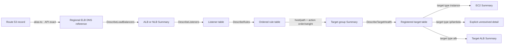

# B2 ELBv2 ingress trace 기준선

독자        binbox-cli 개발·운영자
목적        Route 53 alias에서 실제 ELBv2 compute target까지 이어지는 live read 경계와 검증 근거를 고정한다.
대상 환경   `bb aws browse`, AWS commercial 및 China partition의 지원 DNS 형식
최종 검토   2026-08-28
다음 검토   실제 `udg` account smoke 또는 ELBv2 API/DNS 형식 변경 시
상태        구현 완료, 실제 account ELBv2 smoke는 권한 gate로 차단

## B2는 ELBv2 ingress chain을 기존 live browser에 추가했다

Route 53의 API-exact alias DNS를 지역별 ELBv2 조회로 전환하고, canonical ARN을 확인한 뒤 listener, ordered rule, target group, target health를 단계적으로 조회한다. 모든 호출은 기존 verified profile/account context와 read guard를 사용하며 AWS mutation API는 노출하지 않는다.

IP target은 EC2 instance로 추측하지 않는다. TUI는 IP와 health 상태를 최종 target으로 보여주고 `IP target; no EC2 instance inference`를 미해결 사유로 표시한다.

## 요구사항, 제약, 가정

요구사항:

- exact domain에서 ALB/NLB의 listener와 rule condition을 거쳐 등록 target까지 같은 browser history stack으로 이동한다.
- listener priority, host/path condition, action order, target group weight를 relation evidence에 보존한다.
- `instance`, `ip`, `lambda`, `alb` target identity를 구분한다.

제약:

- profile이 credentials와 account ownership을 결정한다. Route 53 alias가 다른 account의 load balancer를 가리키면 현재 profile 조회에서는 resource를 확인할 수 없다.
- provider는 `DescribeLoadBalancers`, `DescribeListeners`, `DescribeRules`, `DescribeTargetGroups`, `DescribeTargetHealth`만 사용한다.
- ACM, Lambda detail, Classic ELB, reverse graph query는 B2 범위에 포함하지 않는다.

가정:

- Route 53이 반환한 ELB alias DNS는 `<name>.<region>.elb.amazonaws.com` 또는 China partition의 `.com.cn` 형식이며 선택적으로 `dualstack.` prefix를 갖는다. 형식이 바뀌면 alias가 evidence-only로 남으므로 DNS recognizer를 재검토해야 한다.
- listener rule API가 반환한 배열 순서는 AWS의 rule order다. provider는 이를 다시 정렬하지 않는다.

## 현재 구조에서 추가된 차이는 ELBv2 provider와 다섯 개 route target이다

변경 전에는 Route 53 alias가 CloudFront fixed zone일 때만 live target으로 이동했다. B2는 다음 흐름을 추가했다.

이 흐름에서 볼 것은 DNS reference가 canonical load balancer가 아니라는 점이다. `DescribeLoadBalancers`가 같은 region/account에서 DNS를 정확히 확인한 뒤에만 load balancer ARN이 canonical resource가 된다.

컴포넌트 책임:

- Route 53 provider: strict ELB DNS 형식을 regional lookup reference로 만든다.
- Runtime dispatcher: DNS에서 region을 결정하고 opaque TUI target을 allowlisted ELBv2 request parameter로 변환한다.
- ELBv2 provider: SDK response를 canonical resources와 API-exact relation evidence로 정규화한다.
- Projection/model: load balancer→listeners, listener→rules, target group→targets collection을 Summary category로 노출한다.
- Read guard/runtime: verified identity와 credential generation이 바뀐 응답을 폐기하고 SDK endpoint override를 차단한다.

## relation evidence 하나로 forward와 향후 reverse index를 구성한다

Rule→target group과 target→instance/ALB edge는 `source`, `target`, `relation_type`, `direction`, `condition`, `kind`, `reason`, `operation`, `scope`, `observed_at`을 함께 저장한다. Forward TUI는 `target`과 condition을 투영하고, B3 reverse index는 같은 source/target evidence를 역방향으로 읽는다.

IP와 Lambda target은 type을 유지하되 소유 resource를 추측하지 않는다. Lambda provider가 추가되기 전에는 ARN이 Detail에 남고, IP는 address/port/AZ/health와 명시적 미해결 사유가 남는다.

## 실패는 앞에서 확인한 stack을 지우지 않는다

- DNS 형식 불일치: Route 53 alias relation은 보이지만 navigable target을 만들지 않는다.
- 같은 profile/account에서 ELBv2 DNS 미발견: ELBv2 frame은 empty가 되고 이전 Route 53 Summary는 browser back stack에 유지된다.
- 권한 부족 또는 throttling: 기존 typed provider failure로 표시하며 앞선 relation evidence는 유지된다.
- target health empty: registered target table이 empty로 종료된다.
- IP/Lambda target: 오류로 처리하지 않고 지원 범위가 표시된 최종 resource row로 종료한다.
- credential generation 변경: read guard가 응답 commit을 거부한다.

## 확장 한계와 재검토 트리거

- Classic ELB alias도 유사한 DNS 형식을 사용한다. ELBv2 `DescribeLoadBalancers`에서 확인되지 않으면 B2는 empty로 종료하며 Classic ELB로 자동 fallback하지 않는다.
- 다른 account의 alias target은 현재 profile로 확인되지 않는다. B3 snapshot graph가 account/profile evidence를 확보하기 전에는 cross-account ownership을 추정하지 않는다.
- 한 region의 load balancer 전체 목록 조회가 운영상 느려지면 DNS lookup cache 또는 bounded snapshot index를 검토한다. `DESIGN.md`의 10초 snapshot 기준은 별도 collector에 적용하고, live DNS lookup 지연은 실제 account smoke에서 측정한다.
- AWS가 ELB DNS suffix나 listener rule contract를 변경하면 DNS recognizer와 fixture를 함께 갱신한다.

## 운영 인계와 검증 근거

2026-08-28 local fixture에서 다음을 검증했다.

- `dualstack` Route 53 alias가 관찰 region으로 전환된다.
- ALB Summary의 Listeners와 listener Summary의 Listener rules가 singleton detour 없이 열린다.
- priority `10`, host `api.example.com`, path `/v1/*`, action order, weight `80`이 relation condition에 남는다.
- instance target은 EC2 exact target으로 이동하고 IP target은 EC2 추론 없이 종료한다.
- raw rule relation의 source/target으로 reverse edge를 재구성할 수 있다.
- provider/unit/model/integration fixture가 credential-free로 반복 실행된다.

2026-08-28 `lg-udg-ops` profile은 STS identity 확인에 성공했지만 `elasticloadbalancing:DescribeLoadBalancers`가 identity policy의 explicit deny로 차단됐다. 대표 ALB와 NLB domain smoke는 이 read 권한이 허용된 profile에서 다시 수행해 observed latency와 empty/cross-account 종료 문구를 확인한다. 결과가 fixture와 다르면 이 문서와 fixture를 함께 갱신한다.
