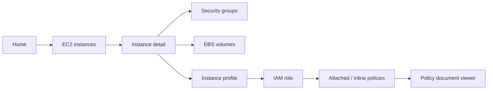

# AWS Browse v2 PRD: 필요한 서비스만 열고 관계로 이동한다

독자        저장소 소유자와 구현·검토 담당자
목적        AWS Console 반복 탐색을 대체하는 category-first, on-demand, multi-account read-only TUI의 제품 범위를 고정한다
대상 환경   AWS SDK for Go v2, AWS CLI v2, 여러 AWS CLI profile, regional EC2/VPC와 global IAM/Route 53
최종 검토   2026-08-28
다음 검토   선택적 tmux/interactive resize 관찰 및 실계정 gate 승인 시
상태        구현·자동 Linux PTY·자동 release gate 완료, 수동/외부 acceptance 대기
등급        L2, 구현·회귀 검증의 기준으로 6개월 이상 사용

관련 문서   [설계](DESIGN.md) · [동작 시나리오](SCENARIOS.md) · [아키텍처](ARCHITECTURE.md) · [ADR-001](ADR-001-HYBRID-AWS-ACCESS.md) · [구현 작업 방식](IMPLEMENTATION-WORKFLOW.md) · [검토 기록](REVIEW.md) · [인덱스](README.md)

이 문서의 persistent DB 비목표는 live browser 기본 경로에 적용한다. 멀티계정 reverse/path/diff를 위한 optional snapshot graph는 [관계 탐색 확장 설계](design-aws-tui-202608.md)가 별도로 소유한다.

`bb aws browse`는 AWS Console의 서비스별 탐색 방식을 터미널에 맞게 줄인 전용 inspector다. 첫 화면은 네트워크 호출 없이 서비스 카탈로그를 즉시 보여주고, 사용자가 연 카테고리와 관계만 lazy load한다. 계정을 모르는 도메인·role 검색은 검색 확정 시 여러 profile을 자동으로 병렬 조회해 콘솔과 계정을 다시 여는 과정을 없앤다.

## 해결할 문제는 “목록 조회”가 아니라 탐색 문맥의 손실이다

현재 작업은 다음처럼 끊긴다.

1. EC2 Console에서 instance를 찾는다.
2. 아래로 내려가 EBS·SG·instance profile ARN을 확인한다.
3. 서비스 화면을 바꾸고 ID나 이름을 다시 검색한다.
4. IAM role의 attached/inline policy와 policy document를 다시 연다.
5. Route 53 결과가 없으면 계정이 틀렸는지 의심하고 다른 account/role로 Console을 다시 연다.
6. 같은 검색어를 반복한다.

Superseded v1 초안은 첫 화면 전에 STS, EC2/VPC 6종, Route 53 전체 zone/record, IAM user/role을 AWS CLI로 직렬 수집했다. 한 zone fixture만으로도 11번의 process 호출을 선행해 화면상 category-first여도 요청 방식은 full preload였다. 구현된 v2 core는 browser의 AWS CLI capability를 profile discovery·credential export에 한정하고 resource data-plane을 AWS SDK for Go v2로 통일한다.

## 사용자와 사용 맥락

- 주 사용자: 여러 AWS account/role을 오가며 인프라를 확인하는 저장소 소유자.
- 사용 시점: 장애 확인, 배포 전 영향 범위 확인, DNS 소유 계정 찾기, EC2 network/storage/IAM 구성 추적.
- 입력 문맥: 정확한 ID를 알 때도 있고 `Name` tag, domain, role 일부만 알 때도 있다.
- 단말 문맥: 넓은 로컬 터미널, 좁은 tmux pane, Orca terminal.
- 안전 기대: 조회 중 account context가 몰래 바뀌지 않고, AWS 리소스가 절대 변경되지 않으며, 어느 account/region의 결과인지 항상 보인다.

## 목표와 성공 신호

### 목표

- 홈 화면은 AWS inventory 수집을 기다리지 않고 열린다.
- EC2 상세에서 EBS, SG, VPC, Subnet, instance profile, IAM role, policy까지 back stack을 유지하며 이동한다.
- Route 53 hosted zone과 record를 검색하고, 소유 계정을 모르면 다른 profile을 자동 조회한다.
- Tag·SG rule·policy document를 생략 없이 읽을 수 있다.
- 느린 account나 `AccessDenied`가 다른 account의 결과를 막지 않는다.
- 각 결과에 profile, account ID, role, region, 조회 시각, 정확도/coverage를 표시한다.

### 성공 신호

다음 값은 2026-08-27 설계 목표이며 구현 후 PTY·fixture·실계정 smoke로 측정한다.

- Home 첫 frame은 250ms 이내에 표시되고 실제 AWS latency와 무관하게 key 입력을 받는다.
- 홈 첫 frame 전에 AWS CLI process와 SDK request 0회.
- 선택하지 않은 category의 AWS API 호출 0회.
- 로딩 중 키 입력·뒤로 가기·취소가 멈추지 않음.
- cross-profile 검색의 동시 실행 수가 설정 상한을 넘지 않음.
- 한 profile의 인증 만료·권한 실패·throttling이 전체 검색을 실패시키지 않음.
- 동일 ID가 다른 account/region에 존재해도 결과가 합쳐지거나 덮어써지지 않음.
- Tag, SG rule, policy document의 원문 내용이 UI 모델에서 잘리지 않음. 화면 폭에 따라 wrap하거나 전용 viewer로 이동한다.
- fake SDK client에서 bb가 요청한 resource operation은 exact read allowlist 밖 호출 0회이며, resource operation용 AWS CLI subprocess는 0회다.
- CloudTrail smoke는 SDK resource read와 CLI credential/profile 처리에 필요한 승인된 STS/SSO 인증 호출을 구분해 기록한다.
- EC2 list가 열린 상태에서 선택한 instance → Security tab → SG full inbound rule은 Enter 3회 이내다.
- 같은 시작점에서 instance → IAM tab → role → policy document는 role/ARN 재입력 없이 Enter 4회 이내다.

## 비목표가 read-only 범위를 지킨다

- AWS 리소스 생성·변경·삭제, EC2 start/stop, SG rule 편집, DNS 변경.
- AWS Organizations 전체 account 자동 발견·권한 위임. 검색 대상은 로컬 AWS CLI profile에서 출발한다.
- effective permission 계산이나 IAM Policy Simulator 대체.
- 모든 AWS 서비스를 한 번에 지원하는 범용 asset inventory.
- 백그라운드 daemon, 영구 DB, 주기적 동기화.
- AWS CLI resource-operation fallback. Data-plane 구현은 SDK 한 벌만 유지한다.
- Console의 시각을 픽셀 단위로 복제하거나 마우스 중심 UX를 구현하는 일.
- 모든 리전의 모든 리소스를 기본 검색하는 일.

## 핵심 사용자 흐름

### 흐름 A: EC2에서 연결 리소스와 policy까지 이동



이 그림에서 볼 것은 service root로 돌아가지 않고 한 탐색 stack 안에서 연결 리소스를 계속 여는다는 점이다.

### 흐름 B: 도메인의 소유 account와 target 찾기

1. 소유 account를 모르면 Home에서 `Cross-profile search > Domain`을 연다. `Route 53 Hosted Zones`는 현재 context만 탐색한다.
2. domain/record 이름을 입력하고 Enter로 검색을 확정한다.
3. 현재 context 결과를 먼저 보여주고, 다른 profile 검색 결과를 streaming append한다.
4. 진행 표시는 `searched 5/12 · found 2 · login required 1`처럼 coverage를 숨기지 않는다.
5. hosted zone → record → alias/IP/DNS target → 지원되는 AWS 리소스로 이동한다.
6. 결과를 열면 해당 account/role context로 탐색 문맥만 전환한다. parent shell credential은 변경하지 않는다.

P0의 cross-profile Domain search는 선택한 모든 profile에서 Route 53을 검색하지만 regional target resolver는 선택 region 하나만 확인한다. 다른 region 가능성이 남으면 `unresolved outside selected region`으로 표시하고 `not found`로 단정하지 않는다.

### 흐름 C: 같은 role이 어느 account에 있는지 확인

1. `Cross-profile search`에서 type을 `IAM role`로 고르거나 role ARN/name을 입력한다.
2. 정확한 role name이면 profile별 `GetRole`을 우선해 빠르게 확인한다.
3. 부분 검색은 사용자가 `deep search`를 확정했을 때만 `ListRoles`를 fan-out한다.
4. 결과는 account ID, profile, role path, last used를 표시한다. Policy count는 role detail의 policy tab을 열기 전까지 `not loaded`다.

## 정보 구조는 AWS Console의 서비스 진입과 관계 탐색을 결합한다

```text
AWS Browse
├─ EC2
│  ├─ Instances
│  ├─ Volumes
│  └─ Security Groups
├─ Route 53
│  ├─ Hosted Zones
│  └─ Domain / Record Search
├─ IAM
│  ├─ Roles
│  └─ Policies (role에서 진입 우선)
├─ VPC & Network
│  ├─ VPCs
│  ├─ Subnets
│  └─ Route Tables
├─ Cross-profile Search
└─ Account / Region Contexts
```

카테고리의 resource count는 홈 진입 시 조회하지 않는다. `not loaded`, 마지막 session cache 시각, 오류 badge만 표시한다.

## 기능 요구사항

### P0: 실제 EC2·DNS 확인 흐름을 끝낸다

- 로컬 context bar와 service catalog를 즉시 렌더링한다.
- EC2 service 안에서 Instances, Volumes, Security Groups를 고르면 각각 `DescribeInstances`, `DescribeVolumes`, `DescribeSecurityGroups`만 요청한다. Instances가 기본 route다.
- IAM Roles category는 `ListRoles`, VPC & Network category는 `DescribeVpcs`만 먼저 요청한다. Subnet과 Route Table은 P0에서 VPC/EC2 relation으로 연다.
- instance 상세에서 이미 받은 필드와 관계 placeholder를 즉시 보여준다.
- EBS·SG·VPC·Subnet·instance profile은 선택 시 ID-scoped 조회한다.
- SG ingress/egress는 structured rule table로 표시하고 상세 화면에서 원문을 생략하지 않는다.
- Tag는 summary에서 개수만 보여주고 `Tags`를 열면 key/value 전용 viewer에서 전부 표시한다.
- instance profile에서 IAM role로 이동하고 role의 trust policy, attached managed policy, inline policy 목록을 조회한다.
- policy document는 선택한 policy만 조회한다.
- Route 53 category는 hosted zone 목록만 먼저 읽고, zone 선택 시 record를 progressive load한다.
- exact domain/role cross-profile search는 AWS CLI가 인식하는 모든 profile을 기본 범위로 삼아 제한된 동시성으로 자동 조회한다. 사용자는 제출 전에 scope를 줄일 수 있다.
- profile discovery와 ambient/named credential export는 AWS CLI가 맡고, STS·EC2·IAM·Route 53 resource operation은 AWS SDK for Go v2만 사용한다.
- 모든 view에 account/profile/principal/region을 표시한다. `Ready`, `Empty`, `Stale` data만 `fetched_at`을 표시한다.
- partial error, retry, cancel, refresh를 제공한다.

### P1: 관계 정확도와 검색 범위를 높인다

- ENI/EIP, ELBv2 target group/load balancer, CloudFront alias resolver.
- profile group과 검색 제외 목록.
- 선택된 여러 region의 regional resource 검색.
- Route 53 record value 검색의 deep mode. Exact name의 bounded pagination은 P0에 포함한다.
- resource ID/ARN/domain 자동 type detection을 포함한 command palette.

### P2: 반복 조사 시간을 더 줄인다

- 최근 열어본 resource와 pinned context를 로컬 metadata로 저장한다. AWS payload는 저장하지 않는다.
- 두 account/region 결과 비교 view.
- 현재 탐색 경로의 read-only report export.

## 상세 화면은 요약과 원문을 분리한다

| 데이터 | 목록/Overview | 열었을 때 |
|---|---|---|
| Tags | `Tags 14` | 전체 key/value table, wrap·검색 |
| Security Group | 이름·ID·rule 수 | Inbound/Outbound 탭, rule 단위 행 |
| EBS | device·size·state | 암호화/KMS/snapshot/tag 전체 상세 |
| IAM role | 이름·ARN·policy 수 | Trust/Attached/Inline/Tags 탭 |
| Policy | 이름·type·version | 선택 version JSON viewer |
| Route 53 record | name·type·target 요약 | TTL/routing policy/set ID/values/alias 전체 상세 |

한 줄 잘림은 목록에서만 허용한다. 상세 viewer는 줄바꿈, 세로 scroll, 검색 가능한 원문을 제공하고 숨긴 값이 있으면 `…` 대신 `open to view`를 표시한다. Clipboard integration은 P1이다.

## 멀티계정 자동 검색 계약

- 검색 단위는 `assume`이 아니라 AWS CLI `profile`을 해석한 `account/role context`다.
- profile 발견은 AWS CLI의 profile 목록을 기준으로 하고, 현재 context를 가장 먼저 검색한다.
- 기본 scope는 모든 discovered profile이며 search overlay에서 session 범위를 줄일 수 있다. 이는 Organizations의 모든 account를 뜻하지 않는다.
- network fan-out은 Enter로 검색을 확정한 뒤 시작한다. 키 입력마다 AWS 호출하지 않는다.
- 기본 동시성 상한은 구현 시 fixture 부하 테스트로 결정하되, 무제한 goroutine은 금지한다.
- 취소하면 새 요청을 시작하지 않고 실행 중 SDK request context와 credential export child를 종료한다.
- 동일 account/role을 가리키는 profile은 결과를 하나로 합치되, 사용 가능한 profile 이름은 함께 표시한다.
- 만료된 SSO profile은 다른 결과를 막지 않고 `login required`로 집계한다. TUI가 임의로 browser login을 시작하지 않는다.
- 결과가 없을 때 `not found`와 `not searched`를 구분한다.

## 명령과 용어

- 유지: `bb aws browse [--profile NAME] [--region REGION]`는 전용 TUI 진입점이다.
- 변경: interactive `bb aws browse`에서 `--json`을 제거했다. 자동화는 명시적 scope의 `bb aws query ... --json`을 사용한다.
- 추가: P0 non-interactive 조회는 `bb aws query ec2 instances`, `bb aws query domain <fqdn>`, `bb aws query role <exact-name>`이며 `--profile`, `--region`, `--scope current|all`, `--json`을 지원한다. `--json`은 schema-v1 envelope 안에 query, coverage, results, errors를 담는다.
- non-TTY `bb aws browse`는 AWS를 호출하거나 prompt를 열지 않고 `bb aws query` 사용법을 반환한다.
- 유지: 이미 배포된 `bb aws assume`과 `bb assume`은 호환 command로 남긴다.
- 변경: 새 UI·문서·type 이름은 `AWS profile`, `account/role context`, `cross-profile search`를 사용한다.
- 선택 사항: command surface를 정리할 때 `bb aws context`를 추가할 수 있지만 P0 blocker는 아니다.

## 기존 대안과 차별점

- AWS Console은 서비스 상세가 가장 풍부하지만 account와 service를 바꿀 때 탐색 문맥이 끊긴다.
- AWS CLI는 정확하지만 ID 관계를 사용자가 직접 조합한다.
- resource 조회를 모두 AWS CLI subprocess로 구현하면 dependency는 적지만 profile fan-out에서 process 시작·JSON decode·수동 pagination 비용이 반복된다.
- SDK만 사용하면 resource 조회는 단순하지만 profile discovery, SSO login, released `bb assume` 인증 UX를 다시 구현해야 한다.
- 선택안은 hybrid다. Browser의 CLI는 profile discovery·credential export, SDK는 STS identity와 resource read·retry·pagination·typed error를 맡는다. 기존 SSO login/assume은 별도 호환 surface며 세부 경계는 [ADR-001](ADR-001-HYBRID-AWS-ACCESS.md)에 고정한다.
- Steampipe/CloudQuery는 광범위한 inventory와 query에 강하지만 이 도구가 원하는 즉시 탐색·관계 stack에는 저장·SQL 계층이 과하다.
- 범용 AWS TUI를 채택하지 않는 이유는 기존 bb profile/SSO 흐름, 엄격한 read-only 계약, 필요한 EC2↔IAM↔DNS 연결을 좁게 최적화하기 위해서다.

## 마일스톤 완료 조건

- Phase 0, credential·security gate: ambient/SSO/assume-role/process profile, endpoint 격리, cache expiry, cancellation, binary 크기와 12-profile 기준 측정이 [ADR-001 gate](ADR-001-HYBRID-AWS-ACCESS.md#p0-validation-gate)를 통과한다.
- P0-A, shell: 홈이 CLI process와 SDK request 없이 열리고 category별 loading/cancel/error 상태가 PTY test를 통과한다.
- P0-B, EC2 walk: instance → SG/EBS/instance profile → role → policy를 fixture와 실계정 read-only smoke로 끝까지 이동한다.
- P0-C, cross-profile: domain exact search와 role exact search가 제한된 동시성, 부분 실패, coverage 표시, resource-key 격리를 통과한다.
- P0-D, hardening: `go test ./...`, `go vet ./...`, `go build ./cmd/bb`, race 대상 test, CloudTrail read-only 검증이 통과한다.

## 가정과 틀렸을 때의 영향

- 로컬 AWS CLI profile이 검색할 account/role의 실용적인 목록이다. 틀리면 Organizations/Identity Center account discovery가 별도 프로젝트가 된다.
- 사용자는 한 번에 한 region을 주로 조사한다. 틀리면 region fan-out을 P0에 포함해야 한다.
- exact domain/role 검색이 cross-account 조사 대부분을 해결한다. 틀리면 P1 deep search의 비용·UX를 앞당겨야 한다.
- AWS CLI credential export를 취소할 수 있고 structured error와 SSO cache 근거로 인증 만료를 분리할 수 있다. 틀리면 helper process credential broker 또는 profile 지원 범위 축소를 ADR로 검토한다.
- AWS SDK module 추가에 따른 binary 크기와 update 비용이 단일 bb binary 배포 범위 안이다. 틀리면 service module split이나 별도 read-only helper를 비교한다.

## 재검토 트리거

- service adapter가 10개를 넘으면 provider registry와 SDK module update 정책을 ADR에서 재검토한다.
- AWS SDK module 추가 후 binary가 Phase 0에서 정한 release budget을 넘으면 service module split이나 helper binary를 비교한다.
- 한 cross-profile search가 일반 환경에서 반복적으로 10초를 넘으면 profile scope, server-side exact query, cache 정책을 재조정한다.
- `not searched` profile이 20%를 반복적으로 넘으면 login 상태 preflight와 profile group을 P0로 올린다.
- resource 1,000개 이상에서 table filter가 즉시 반응하지 않으면 virtualized row와 incremental pagination을 도입한다.

## 공식 근거

- AWS CLI는 [구성된 profile 목록 조회](https://docs.aws.amazon.com/cli/latest/reference/configure/list-profiles.html), [ambient/named credential export](https://docs.aws.amazon.com/cli/latest/reference/configure/export-credentials.html), SSO login을 제공한다.
- AWS SDK for Go v2는 [shared profile·SSO·assume-role·process credential](https://docs.aws.amazon.com/sdk-for-go/v2/developer-guide/configure-gosdk.html), [context 기반 retry·timeout](https://docs.aws.amazon.com/sdk-for-go/v2/developer-guide/configure-retries-timeouts.html), [typed error](https://docs.aws.amazon.com/sdk-for-go/v2/developer-guide/handle-errors.html)를 제공한다.
- Route 53은 [SDK paginator](https://pkg.go.dev/github.com/aws/aws-sdk-go-v2/service/route53#ListResourceRecordSetsPaginator)와 cursor input을 사용해 progressive browse와 exact-name early stop을 구현한다.
- EC2 instance profile은 IAM `GetInstanceProfile`로 role 관계를 확인한다.
- Security Group rule은 [DescribeSecurityGroupRules](https://docs.aws.amazon.com/AWSEC2/latest/APIReference/API_DescribeSecurityGroupRules.html)로 rule 단위 조회할 수 있다.
- Route 53 API는 account별 throttling을 적용하므로 [quota와 exponential backoff 지침](https://docs.aws.amazon.com/Route53/latest/DeveloperGuide/DNSLimitations.html)을 전역 검색 설계에 반영한다.
