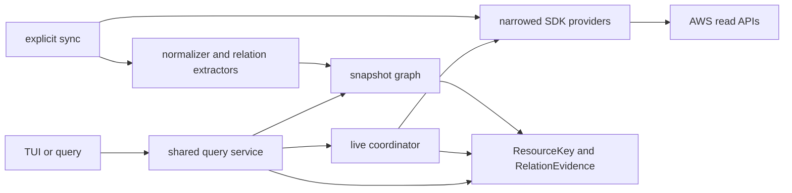

# AWS TUI 관계 탐색 확장 설계

독자        저장소 소유자와 구현·검토 담당자
목적        구현된 live AWS browser 위에 멀티계정 관계 탐색과 선택적 snapshot graph를 추가하는 방향을 확정한다
대상 환경   Go, Bubble Tea v2, AWS SDK for Go v2, AWS CLI v2, 여러 profile·account·region
최종 검토   2026-08-28
다음 검토   snapshot graph PoC 결과 또는 실계정 acceptance 완료 시
상태        재기획 초안 — 기존 구현 기준선 반영, 확장 구현 전
등급        L2 — 저장소 구현·회귀 검증의 기준으로 6개월 이상 사용

관련 문서   [관계 계약](spec-aws-tui-relations-202608.md) · [기존 PRD](PRD.md) · [기존 UX](DESIGN.md) · [기존 아키텍처](ARCHITECTURE.md) · [AWS 접근 ADR](ADR-001-HYBRID-AWS-ACCESS.md) · [루트 디자인 계약](../DESIGN.md)

## 결론 — live browser는 유지하고 관계 그래프만 snapshot으로 보강한다

`bb aws browse`는 이미 profile 선택, current/all-region scope, progressive SDK 조회, Summary/Detail/Tags, 관계 이동, cross-profile search를 제공한다. 이를 폐기하고 SQLite 전용 도구로 다시 만드는 안은 채택하지 않는다.

목표 구조는 **Live Browse + Snapshot Graph의 하이브리드**다. 현재 리소스의 정확한 상태와 단건 검증은 live 경로가 담당하고, 여러 account·region을 가로지르는 역방향 조회·경로 탐색·diff처럼 요청 시점 fan-out이 비효율적인 기능만 명시적 `sync` 결과를 사용한다.

TUI는 k9s의 화면 복제가 아니라 터미널 상호작용 규칙을 채택한다. 전체 화면, `:` command, `/` filter, 고정 context/status/footer, 빠른 back/forward history는 사용한다. 리소스 변경 명령, cluster 문맥, 색상만으로 상태를 구분하는 방식은 가져오지 않는다.

### 기존 두 초안에서 채택·수정·폐기할 항목

| 판단 | 초안 항목 | 재기획 결론 |
|---|---|---|
| 채택 | 전체 화면 TUI, relation 전용 화면, reverse query, snapshot age·coverage | 현재 full-screen route stack과 evidence table 위에 확장한다 |
| 수정 | `sync`와 SQLite | live 기본 경로가 아니라 멀티계정 reverse/path/diff용 optional PoC로 한정한다 |
| 수정 | CLI 위에 TUI | CLI와 TUI가 공통 Go query service를 사용하는 형제 surface로 둔다 |
| 수정 | 수십 service edge 카탈로그 | 사용자 질문 단위 Tier와 vertical slice로 축소한다 |
| 폐기 | 신규 구축, snapshot-only 조회 | 구현된 progressive live browser를 기준선으로 삼는다 |
| 폐기 | ARN 중심 identity와 `raw_json` 저장 | 기존 ResourceKey를 재사용하고 allowlisted normalized field만 저장한다 |
| 폐기 | 단순 graph path를 network reachability로 설명 | resource relation path와 packet reachability를 분리한다 |
| 폐기 | 외부 boto3/Cytoscape 자산을 확인 없이 통합 전제로 사용 | 실제 자산과 owner/schema를 확인하기 전에는 범위 밖으로 둔다 |

## 현재 구조는 신규가 아니라 구현된 live progressive browser다

2026-08-28 저장소 기준 사실은 다음과 같다.

| 영역 | 구현된 기준선 | 확장 시 보존할 계약 |
|---|---|---|
| AWS 접근 | AWS CLI는 profile discovery·credential export, SDK는 narrowed read operation | CLI resource fallback과 mutation을 추가하지 않는다 |
| context | profile이 credential 경계이며 account/principal은 STS로 검증, current/all configured-region scope 지원 | raw account ID를 인증 선택자로 사용하지 않는다 |
| 조회 | Home은 local-only, 선택한 category·resource·relation만 progressive load | 키 입력마다 AWS 요청하지 않는다 |
| 화면 | 전체 viewport, route stack, Summary→Detail/Relation/Tags, singleton relation list 생략 | 현재 back stack과 local filter를 유지한다 |
| k9s형 조작 | `:` alias command, `/` filter, `Ctrl-o`/`Ctrl-i` history, `c` context, `Ctrl-r` refresh | 기존 Enter/Right open, Left back과 충돌시키지 않는다 |
| 리소스 | EC2/VPC, IAM, Route 53, CloudFront, 제한된 S3 origin verification | 지원하지 않는 target을 소유 리소스로 추정하지 않는다 |
| 저장 | session memory cache와 generation fence | AWS payload를 무제한 영구 저장하지 않는다 |
| 외부 검증 | fixture·PTY·race·vet·build gate는 존재, real AWS/CloudTrail은 외부 acceptance | snapshot 추가 시 별도 coverage·보존·보안 gate가 필요하다 |

코드 근거는 `internal/bb/awsbrowser/model.go`, `view.go`, `query.go`, `store.go`, `relation.go`, `providers/*`, `internal/bb/aws_runtime.go`다. 기존 접근 결정은 [ADR-001](ADR-001-HYBRID-AWS-ACCESS.md)이 소유한다.

## 해결할 문제는 live 상세 조회가 아니라 횡단 질문의 비용이다

현재 live browser는 한 리소스에서 API로 확인 가능한 다음 리소스로 이동하는 데 적합하다. 그러나 다음 질문은 매번 여러 profile·region을 다시 읽어야 하므로 session cache만으로는 완전성과 응답성을 함께 보장하기 어렵다.

- 이 SG를 참조하거나 사용하는 모든 리소스는 무엇인가?
- 이 private IP 또는 domain은 8개 account 중 어디에 속하는가?
- 이 EC2가 Route 53·CloudFront·load balancer 경로의 최종 target인가?
- 어제와 오늘 사이에 관계가 무엇이 바뀌었는가?
- 일부 account가 denied 또는 login required였을 때 결과 범위는 어디까지인가?

관계 탐색의 핵심 제품 가치는 “그래프를 보여준다”가 아니라 **질문의 답과 그 답을 만든 evidence·coverage를 함께 보여주는 것**이다.

## 목표와 비목표

### 목표

- 기존 live browser의 즉시성, 정확한 context, progressive loading을 유지한다.
- exact·inferred·unresolved 관계를 구분하고 operation·관찰 시각·profile/account/region 근거를 보존한다.
- forward와 reverse relation을 같은 데이터 계약으로 조회한다.
- snapshot 결과에 age와 account/region별 success·failed·not-observed coverage를 항상 표시한다.
- snapshot node를 열면 가능한 경우 같은 observed context의 live Summary로 검증한다.
- TUI와 non-interactive query가 같은 Go query service와 도메인 모델을 사용한다.

### 비목표

- 현재 live browser를 snapshot-only 도구로 교체하지 않는다.
- AWS Console 전체 서비스와 k9s UI를 그대로 복제하지 않는다.
- P1에서 network reachability를 단정하지 않는다. 단순 resource graph path와 packet reachability는 별도 기능이다.
- credential, token, policy 원문 전체, provider raw JSON을 persistent index에 저장하지 않는다.
- background daemon, 자동 주기 sync, AWS Organizations 자동 권한 위임을 기본값으로 두지 않는다.
- 생성·수정·삭제·start/stop·SSM session 같은 write 또는 실행 기능을 관계 브라우저에 넣지 않는다.

## 요구사항·제약·가정

### 요구사항

- 여러 profile과 configured region을 하나의 명시적 scope로 수집할 수 있어야 한다.
- 일부 scope 실패가 전체 성공으로 보이지 않아야 한다.
- resource identity는 profile 이름이 아니라 `partition + account + region/global + type + id`로 안정적으로 식별해야 한다.
- 관계는 source/target뿐 아니라 direction, kind, confidence, condition, evidence를 가져야 한다.
- TUI는 40x12 이상에서 전체 viewport를 쓰고, 더 넓거나 높은 화면에서는 실제 데이터 행과 열을 늘려야 한다.
- 모든 기능은 keyboard와 plain fallback에서 도달 가능해야 한다.

### 제약

- read-only provider interface와 endpoint·credential 격리 계약을 유지한다.
- 단일 Go binary 배포를 유지한다. persistent index dependency 채택은 별도 ADR과 binary-size gate를 통과해야 한다.
- TUI 출력은 stderr, machine output은 stdout을 유지한다.
- snapshot은 사용자가 명시적으로 실행한 sync만 갱신한다.

### 가정

| 가정 | 틀렸을 때의 영향 |
|---|---|
| 운영 질문 대부분은 1시간 이내 snapshot으로 충분하다 | 선택 resource의 bounded live refresh 범위를 넓혀야 한다 |
| 노드 10만, 엣지 50만 이하에서 로컬 질의가 주 사용 범위다 | pagination·index 분할·전용 graph store를 재검토한다 |
| 8개 account의 profile과 region group을 로컬 설정으로 표현할 수 있다 | Organizations/Config Aggregator 연동을 별도 제품 범위로 검토한다 |
| 관계 extractor는 service별 allowlist로 관리 가능하다 | schema versioning과 plugin형 extractor 경계를 재설계한다 |

## 목표 구조는 live와 snapshot이 도메인 계약을 공유한다



*이 그림에서 볼 것: TUI가 CLI subprocess를 호출하지 않고, live와 snapshot이 같은 identity·relation 계약을 공유한다.*

### 컴포넌트 책임

| 컴포넌트 | 책임 |
|---|---|
| live coordinator | 현재 context의 exact read, pagination, cancel, partial state, session cache |
| sync coordinator | 명시적 scope fan-out, account/region 단위 성공·실패, atomic snapshot commit |
| normalizer | provider 응답을 allowlisted resource field와 canonical key로 변환 |
| relation extractor | exact/inferred edge와 condition/evidence 생성 |
| snapshot store | versioned run, resource observation, edge, coverage, retention 저장 |
| query service | list, relation, reverse reference, graph path, diff를 live/snapshot source에 맞게 제공 |
| TUI | source·age·coverage가 보이는 full-screen route stack과 command/filter/history 제공 |

### persistent model의 최소 계약

구현 스키마는 PoC와 ADR에서 확정한다. 다만 다음 의미는 고정한다.

```text
snapshot_run  id, started_at, completed_at, schema_version, status
coverage      run_id, profile, account, region/global, service, status, error_kind
resource      resource_key, type, id, name, normalized_fields
observation   run_id, resource_key, profile, account, region/global, observed_at
relation      run_id, source_key, target_ref, kind, direction, confidence, condition, evidence
```

- `target_ref`는 아직 소유 account를 확인하지 못한 DNS·ARN·CIDR 문자열을 보존할 수 있다.
- 같은 resource를 여러 profile에서 봐도 observation은 합치지 않는다.
- `normalized_fields`는 service별 allowlist만 저장한다. `raw_json` 컬럼은 두지 않는다.
- exact relation과 heuristic relation은 같은 화면에서 시각적으로 구분한다.

SQLite는 단일 파일, transaction, recursive CTE, 로컬 디버깅 측면에서 우선 PoC 후보지만 아직 확정 dependency가 아니다. cgo-free driver의 binary size, write latency, license, retention, corruption recovery를 검증한 뒤 ADR로 채택한다.

## k9s형 TUI는 전체 화면 단일 작업공간으로 구성한다

```text
AWS Browser · READ ONLY      LIVE | profile prod | 123456789012 | ap-northeast-2
AWS > EC2 > web-api > Security groups                 coverage 1/1 · fetched 14:32
Filter / web_                         Sort name ↑      4 resources
───────────────────────────────────────────────────────────────────────────────
  NAME             ID             RELATION       ACCOUNT        REGION
> web-alb          sg-01ab        ingress-from   shared-net     ap-northeast-2
  web-runtime      sg-02cd        attached-to    prod           ap-northeast-2
  db-client        sg-03ef        egress-to      data           ap-northeast-2


───────────────────────────────────────────────────────────────────────────────
↑↓ move  →/enter open  ← back  / filter  : command  ^o/^i history  ? help
```

고정 영역은 header, breadcrumb/status, filter/command, footer다. 가운데 table이 남은 높이를 모두 사용한다. 좁아지면 secondary column부터 숨기되 source, context, selection, error·coverage는 숨기지 않는다.

### k9s에서 채택·수정·제외할 것

| 판단 | 항목 | bb 적용 |
|---|---|---|
| 채택 | 전체 alt-screen과 dense table | 화면 크기만큼 행·열을 늘린다 |
| 채택 | `:` resource alias/action command | `ec2`, `sg`, `vpc`, `route53`, `iam`, `context`, `search`, `home`, `refresh` |
| 채택 | `/` local filter와 `?` contextual help | provider 호출 없이 현재 projection만 필터링한다 |
| 수정 | context switch | cluster가 아니라 verified profile + region scope이며 두 단계 verify/apply를 유지한다 |
| 수정 | navigation | Enter/Right open, Left back, `Ctrl-o`/`Ctrl-i` history를 함께 유지한다 |
| 제외 | write action과 confirmation dialog | browser는 read-only invariant다 |
| 제외 | 화면 폭마다 강제 multi-pane | 기본은 route 단위 single workspace, preview pane은 사용성 근거가 생긴 뒤 검토한다 |

### source mode가 화면에서 사라지면 안 된다

- `LIVE`: 현재 SDK 결과. fetched time과 partial coverage를 표시한다.
- `SNAPSHOT`: run time, age, success/failed/not-observed scope를 표시한다.
- `SNAPSHOT → LIVE`: node open 시 exact read를 시작하고, 실패하면 snapshot detail과 실패 이유를 함께 유지한다.
- source 전환은 암묵적으로 일어나지 않는다. header label과 status가 바뀐다.

## 관계 화면은 그래프 그림보다 evidence table을 우선한다

터미널에서 노드-링크 그림은 밀도가 낮고 방향·조건·coverage를 읽기 어렵다. 기본 relation 화면은 edge table로 만들고, 한 행을 열면 evidence와 target Summary로 이동한다.

```text
AWS > binary.example.com > Relations                    SNAPSHOT · 18m old
  DIRECTION  RELATION       TARGET           CONDITION       CONFIDENCE
> →          alias-to       cloudfront/E123  A alias         exact
  →          routes-to      s3/assets-prod   path /assets/*  inferred
  ←          referenced-by  route53/Z001     record exact    exact
```

크로스 account edge는 marker와 account column을 함께 쓰고, condition을 숨기지 않는다. CloudFront behavior path, SG port/CIDR, listener host/path처럼 관계 의미를 바꾸는 조건은 edge identity의 일부다.

## 단계별 구현은 기존 기능을 P0로 다시 만들지 않는다

### B0 — 구현 기준선 고정

- 완료 상태: 2026-08-28 검증 완료. live progressive browser, context group/multi-region, Name-first, Summary/Detail/Tags, current relation navigation, k9s형 full-screen command/filter/history를 기준선으로 고정했다.
- 완료 판정: test·race·vet·stripped build가 통과했고 현행 문서의 centered card·single-region·3-pane 충돌을 정리했다. 증거는 [B0 기준선](B0-BASELINE.md)에 기록한다.

### B1 — 관계 계약 정리와 현재 chain 강화

- 완료 상태: 2026-08-28 검증 완료. 기존 EC2→EBS/SG/VPC/Subnet/IAM, Route 53→CloudFront→S3 관계에 canonical relation type·outgoing direction·condition을 적용했고 기존 evidence/confidence를 유지했다.
- 완료 판정: forward extractor fixture가 같은 target의 서로 다른 CloudFront path edge를 분리하고, live TUI projection과 JSON query가 같은 relation 필드를 보존한다. 증거는 [B1 관계 계약 기준선](B1-RELATION-CONTRACT.md)에 기록한다.

### B1.5 — k9s형 고밀도 테이블 UI

- 완료 상태: 2026-08-28 검증 완료. Home, profile/context, coverage, resource list, Summary category/field, relation, Tags 화면을 uppercase column header와 full-row selection을 사용하는 고밀도 테이블로 통일했다.
- responsive 계약: resource는 `NAME·TYPE·ID·STATUS·ACCOUNT·REGION`, relation은 `DIR·RELATION·TARGET·CONDITION·CONFIDENCE·SCOPE` 우선순위를 사용하고 terminal 폭에 따라 오른쪽 보조 column부터 숨긴다. 40열 relation에서도 condition은 유지한다.
- Detail과 policy document는 구조화된 값을 읽는 scroll view이므로 한 행 table로 변경하지 않았다.
- 완료 판정: 120x30, 80x24, 50x16, 40x12 golden과 관계/context/Tags column test, 전체 test·race·vet·stripped build가 통과했다. 증거는 [B1.5 테이블 기준선](B15-K9S-TABLE.md)에 기록한다.

### B2 — domain에서 compute target까지 live chain 완성

- Route 53→ALB/NLB→listener/rule→target group→target을 existing live coordinator에 추가한다.
- listener rule과 target type의 condition/evidence를 보존하고 IP target을 임의 EC2로 연결하지 않는다.
- 완료 판정: exact domain에서 최종 target 또는 unresolved 이유까지 같은 route stack에서 도달하고 reverse evidence도 fixture로 재구성된다.

### B3 — SG reverse를 이용한 snapshot graph PoC

- 명시적 sync, versioned run, coverage, resource observation, relation 저장을 SG referenced-by/attached-to chain에 구현한다.
- PoC fixture는 2 profile × 2 region의 partial failure, duplicate observation, cross-account reference를 포함한다.
- 완료 판정: 10만 node/50만 edge 합성 fixture에서 relation/reverse/path p95 200ms 이하라는 로컬 목표를 측정하고, binary size·retention·corruption recovery 결과로 SQLite ADR을 작성한다.

### B4 — shortcut query와 diff

- VPC peering/TGW/PrivateLink 관계와 `refs`, `whois`, resource graph `path`, snapshot diff.
- packet reachability는 별도 `network path` 설계와 protocol/port 입력이 준비될 때만 제공한다.
- 완료 판정: 결과가 exact/inferred/unresolved와 not-searched/denied를 구분한다.

## 실패 모드와 대응

| 실패 | 영향 | 대응 |
|---|---|---|
| 일부 profile sync 실패 | 없는 resource와 못 본 resource가 섞임 | coverage row를 run과 함께 atomic commit하고 UI에 failed/not-observed 표시 |
| global resource를 region loop에서 중복 수집 | ghost node와 잘못된 edge | global scope를 canonical key와 collector plan에서 분리 |
| heuristic DNS/ARN match를 exact로 표시 | 잘못된 영향 판단 | confidence와 evidence operation을 강제하고 live verify 제공 |
| snapshot 노후 | 삭제된 관계를 현재 상태로 오인 | source·age를 header에 고정, 임계치 초과 warning |
| sync 중단 또는 저장소 손상 | 최신 run이 불완전 | 새 run을 별도 transaction으로 쓰고 완료 후 active pointer 교체 |
| relation 수 증가 | 한 화면이 무의미한 목록이 됨 | kind/direction/cross-account local filter와 category grouping 제공 |
| live context 인증 만료 | snapshot node 검증 실패 | snapshot detail 유지, login required와 정확한 profile 표시 |

## 보안·운영·확장 한계

- persistent store는 credential·token·secret value·raw policy payload를 저장하지 않는다.
- sync는 기존 read-only allowlist를 확장할 때 provider interface, IAM permission, fixture call assertion, CloudTrail acceptance를 함께 추가한다.
- 기본 동시성은 bounded이며 profile/account/region별 timeout과 retry 결과를 coverage에 남긴다.
- 30 account, 10만 node, 50만 edge, 전체 sync 5분, snapshot age 1시간 중 하나를 넘으면 설계를 재검토한다. 수치는 B3 PoC 전 추정 상한이다.
- AWS Config Aggregator 같은 신뢰할 수 있는 조직 인벤토리가 생기면 custom collector를 유지할 근거를 재검토한다.

## 열린 결정

- [ ] SQLite와 cgo-free driver 채택 여부 — B3 PoC 결과와 ADR에서 결정.
- [ ] snapshot retention과 diff 보존 기간 — B4 전에 디스크 상한과 함께 결정.
- [ ] B3 snapshot PoC에서 SG attachment coverage를 EC2 ENI까지만 제한할지 ELBv2 ENI까지 포함할지.
- [ ] 기존 외부 boto3/Cytoscape 자산의 실제 존재·소유·스키마 — 저장소 밖 자산이므로 확인 전 통합 전제로 사용하지 않는다.
