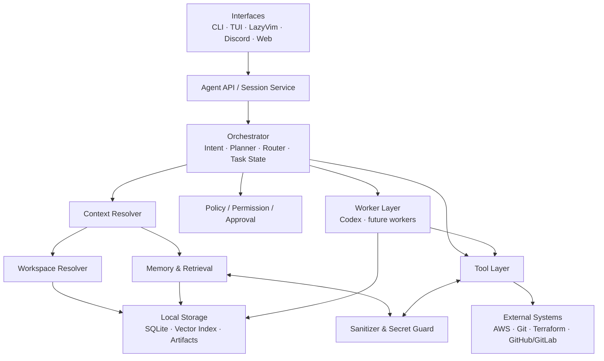

# Baruda Work Agent 기획서

> Codex, AWS, Terraform, Git과 업무 기억을 통합하는 개인 업무용 AI Agent / Work OS

| 항목 | 내용 |
|---|---|
| 문서 상태 | Draft v0.1 — 프로젝트 착수 기준안 |
| 작성일 | 2026-08-10 |
| 제품 가칭 | Baruda Work Agent |
| 1차 대상 | 개인 DevOps/SRE 업무 환경 |
| 1차 인터페이스 | CLI |
| 기본 운영 방식 | Local-first, human-in-the-loop |

---

## 1. 문서 목적

이 문서는 빈 리포지토리에서 Baruda Work Agent 프로젝트를 시작하기 위한 제품·기술 통합 기획서다. 제품이 해결할 문제, 사용 경험, 시스템 경계, 주요 컴포넌트, 보안과 승인 정책, 데이터 모델, MVP 범위, 구현 순서와 성공 기준을 정의한다.

Baruda Work Agent는 Codex 자체를 대체하는 모델이 아니다. 사용자의 요청을 해석하고 적절한 작업 공간과 과거 기록을 찾으며, 필요한 도구와 실행 엔진을 안전하게 조합하는 **상위 업무 오케스트레이터**다. Codex는 이 구조 안에서 코드 분석·수정·검증을 수행하는 Worker 중 하나로 사용한다.

---

## 2. 프로젝트 배경

현재 Codex와 CLI 중심의 개발·운영 업무에는 다음과 같은 마찰이 반복된다.

- 작업할 때마다 사용자가 올바른 리포지토리 디렉토리로 직접 이동해야 한다.
- 리포지토리 경로, AWS 계정·프로파일, 환경명, Terraform 소유 관계를 사람이 기억해야 한다.
- 이전 세션에서 조사한 내용과 의사결정이 다음 세션으로 자연스럽게 이어지지 않는다.
- AWS 조회, 코드 탐색, Terraform 변경, 검증, Git diff 확인이 서로 단절된 도구 흐름으로 수행된다.
- 작업 기록이 터미널 로그나 대화에 흩어져 있어 비슷한 장애와 변경을 다시 조사하게 된다.
- AI가 강력해질수록 잘못된 계정에서의 실행, 파괴적 변경, 비밀정보 저장 같은 위험도 커진다.

DevOps/SRE 업무는 대상 영역을 제한하면 “어제 하던 일을 이어서 하고, 관련 인프라를 조회하고, 관리 코드를 찾아 안전하게 수정하며, 결과를 기억하는” 일관된 Agent 경험으로 통합할 수 있다.

---

## 3. 문제 정의

### 3.1 핵심 문제

사용자의 자연어 요청만으로는 실행에 필요한 다음 정보가 부족하다.

1. 어느 프로젝트와 리포지토리에서 작업해야 하는가?
2. 어느 회사·계정·환경·리전에 관한 요청인가?
3. 대상 리소스는 어떤 Terraform 코드와 상태에서 관리되는가?
4. 과거에 비슷한 조사나 변경을 했으며 어떤 결정을 내렸는가?
5. 어떤 명령은 즉시 실행할 수 있고 어떤 명령은 승인이 필요한가?
6. 작업 결과 중 무엇을 장기 기억으로 남기고 무엇을 폐기해야 하는가?

### 3.2 사용자 관점의 문제

- “어디에서 실행해야 하는지”를 먼저 생각해야 한다.
- 정확한 경로, 리소스 ID, 에러 코드, 과거 문서 위치를 기억해야 한다.
- 조회에서 수정으로 넘어갈 때 맥락을 다시 설명해야 한다.
- 과거 결과의 신뢰도와 현재 유효성을 판단하기 어렵다.
- 자동화를 원하지만 실제 변경과 외부 전송은 통제하고 싶다.

### 3.3 시스템 관점의 문제

- 자연어 표현과 실제 리소스·리포지토리 사이의 소유 관계가 명시되어 있지 않다.
- 세션 로그는 장기 검색에 적합한 업무 단위 데이터가 아니다.
- LLM Context에는 크기 제한이 있으므로 관련 정보만 선별해야 한다.
- 도구마다 권한 모델, 출력 형식, 실패 방식, 부작용이 다르다.
- Secret이나 개인정보가 프롬프트, 로그, 임베딩, 백업에 유입될 수 있다.

---

## 4. 제품 비전과 원칙

### 4.1 제품 비전

사용자가 현재 디렉토리, 리포지토리 경로, AWS 프로파일, 과거 문서 위치를 거의 신경 쓰지 않고 다음과 같이 업무를 수행하게 한다.

```text
> 어제 하던 작업 이어서 해줘
> qa RDS 상태 확인해줘
> 이 리소스를 관리하는 Terraform 찾아줘
> 자동 업데이트를 끄는 방식으로 수정해봐
> plan 결과와 위험을 설명해줘
> 지난번에도 같은 장애가 있었는지 찾아봐
```

### 4.2 설계 원칙

1. **Local-first**: 리포지토리 인덱스와 업무 기록은 기본적으로 로컬에 저장한다.
2. **Context over model**: 모델 교체보다 올바른 Workspace·Memory·Policy Context 제공을 우선한다.
3. **Read before write**: 조회와 분석으로 대상을 확정한 뒤 변경한다.
4. **Least privilege**: 필요한 도구와 범위에만 최소 권한을 부여한다.
5. **Human-in-the-loop**: 외부 시스템 변경, 파괴 작업, 게시·전송은 명시적으로 통제한다.
6. **Evidence first**: 답변과 기억에는 가능하면 파일, 커밋, 명령 결과, 리소스 조회 시각을 연결한다.
7. **Memory is curated**: 원시 로그 전체가 아니라 정제된 업무 기록을 저장한다.
8. **Provider-agnostic workers**: Codex를 우선 사용하되 Worker 인터페이스는 교체 가능하게 만든다.
9. **Personal/Work isolation**: 개인 지식과 회사 업무 기록은 저장소·키·정책 수준에서 분리한다.
10. **Fail closed**: 환경이나 권한이 불명확하면 추측 실행하지 않고 안전하게 중단한다.

---

## 5. 목표

### 5.1 제품 목표

- 어느 디렉토리에서 실행해도 자연어로 올바른 Workspace를 찾는다.
- AWS 리소스에서 관리 Terraform 코드까지 추적한다.
- 조사, 변경, 검증, 요약을 하나의 연속된 업무 흐름으로 제공한다.
- 작업 결과와 결정을 자동으로 구조화하여 이후 자연어로 검색한다.
- 읽기와 변경을 명확히 구분하고 위험도에 따라 승인을 요구한다.
- Secret을 기록·검색·LLM Context에 넣기 전에 제거한다.
- CLI MVP 이후 동일한 Backend를 TUI, LazyVim, Discord, Web에서 재사용한다.

### 5.2 기술 목표

- 핵심 도메인 로직이 UI, LLM, 특정 벤더 SDK에 종속되지 않게 한다.
- 모든 도구 실행에 표준 입력·출력·감사 이벤트를 적용한다.
- 작업 실행을 재현할 수 있도록 대상, 시각, 명령, 결과, 변경, 승인을 연결한다.
- 초기에는 단일 사용자 로컬 운영에 최적화하고 팀 기능으로 확장 가능한 경계를 둔다.

---

## 6. 비목표

MVP에서 다음은 목표로 하지 않는다.

- 승인 없는 완전 자율 운영 또는 무인 프로덕션 변경
- AWS Console, Terraform Cloud, GitHub/GitLab 등 기존 시스템의 완전한 대체
- 모든 클라우드와 개발 도구를 동시에 지원하는 범용 플랫폼
- 원시 터미널 출력과 전체 대화의 무제한 영구 보존
- Secret Manager의 비밀값 조회·보관·표시 기능
- 자동 배포, 자동 merge, 자동 장애 복구의 기본 활성화
- 멀티테넌트 SaaS와 조직 단위 권한 관리
- 범용 개인 비서, 일정·메일·생활 데이터와 회사 Memory의 결합
- 완벽한 자연어 해석을 전제로 한 무확인 실행

---

## 7. 대상 사용자와 핵심 Jobs-to-be-Done

### 7.1 1차 사용자

- 여러 리포지토리와 AWS 계정을 오가는 개인 DevOps/SRE 엔지니어
- Terraform 기반 인프라를 운영하며 반복 조사와 변경이 잦은 사용자
- Codex를 활용하지만 작업 Context와 과거 기록을 수동으로 관리하는 사용자

### 7.2 핵심 업무

- 프로젝트나 리포지토리 찾기
- AWS 리소스 상태와 메타데이터 조회
- AWS 리소스의 Terraform 소유 코드 추적
- 코드 수정과 정적 검증 수행
- Git 변경 내역 확인 및 설명
- 과거 작업·결정·장애 해결 기록 검색
- 중단한 작업 재개
- 완료된 작업의 자동 기록과 감사 추적

---

## 8. 핵심 UX

### 8.1 기본 진입

```bash
baruda
```

현재 디렉토리가 Workspace 내부면 이를 우선 후보로 사용하고, 그렇지 않으면 Registry와 Memory를 검색한다.

### 8.2 응답의 기본 형식

사용자는 내부 라우팅 세부사항보다 다음을 명확히 확인할 수 있어야 한다.

- 이해한 대상: 프로젝트, 환경, 계정, 리전, 리소스
- 수행할 작업과 예상 영향
- 실행 전 필요한 승인
- 실행 근거와 결과
- 변경 파일과 검증 결과
- 기록 여부와 검색 가능한 작업 ID

예시:

```text
대상: pak-infra / qa / ap-northeast-2
리소스: pak-qa-rds03
현재 상태: available, 유지보수 예정
관리 코드: real/qa/rds/main.tf

자동 minor upgrade를 비활성화하는 변경안을 만들었습니다.
terraform fmt: PASS
terraform validate: PASS
외부 반영은 하지 않았습니다.
```

### 8.3 모호성 처리

- 후보가 하나이고 신뢰도가 기준 이상이면 자동 선택하되 선택 결과를 표시한다.
- 후보가 여러 개면 상위 후보와 구분 근거를 제시하고 확인받는다.
- `prod`, 계정 변경, 리전 변경, 파괴 가능성이 있는 경우 신뢰도가 높아도 명시적으로 재확인한다.
- 대명사(“이거”, “그 프로젝트”)는 현재 Task Context에서만 해석하며 세션 경계를 넘으면 근거를 표시한다.

### 8.4 작업 상태

작업은 다음 상태를 가진다.

```text
created → resolving → planned → awaiting_approval → executing
        → validating → summarizing → completed
        ↘ blocked / failed / cancelled
```

---

## 9. 주요 사용 시나리오

### 시나리오 A — 과거 작업 검색과 재개

```text
사용자: 지난번 PAK Jenkins 컨테이너화 작업 찾아봐
Baruda: 관련 작업 1건을 찾음
        - 프로젝트: pak-jenkins
        - 마지막 결정: Jenkins 컨테이너 + Ansible 배포
        - 다음 작업: PAK 전환 PoC
사용자: 그 프로젝트 현재 상태 확인해줘
Baruda: Workspace 확인 → git status/log → 관련 문서와 마지막 Task 연결
```

### 시나리오 B — AWS 조회에서 Terraform 코드로 이동

```text
사용자: qa RDS 상태 확인해줘
Baruda: qa 계정·리전 확인 → 읽기 전용 AWS 조회 → 결과에 조회 시각 표시
사용자: 03번 유지보수 원인 봐줘
Baruda: 선택된 리소스를 Task Context에서 이어받아 이벤트·설정 조회
사용자: 이 설정 Terraform 어디서 관리해?
Baruda: 태그·ARN·이름·state mapping·코드 인덱스로 소유 리포지토리와 파일 탐색
```

### 시나리오 C — 안전한 Terraform 변경

```text
사용자: 자동 업데이트 끄는 방식으로 수정해봐
Baruda: 코드 위치와 환경 확정 → 변경 계획 제시 → Codex Worker 실행
        → terraform fmt/validate → diff 요약
        → apply, commit, push는 수행하지 않음
```

### 시나리오 D — 유사 장애 회고

```text
사용자: 전에 Windows Update에서 COM 오류 난 적 있어?
Baruda: semantic + keyword hybrid search
        → 관련 Incident, 에러 코드, 해결 방법, 근거 링크 반환
        → 오래된 기록은 현재 유효성 재검증 필요 표시
```

### 시나리오 E — 잘못된 대상 방지

```text
사용자: 이 변경 prod에도 적용해
Baruda: prod 계정·Workspace·변경 범위 표시
        → plan 생성 승인
        → plan 결과 표시
        → apply는 별도 고위험 승인 없이는 실행 불가
```

---

## 10. 전체 아키텍처



### 10.1 논리 계층

1. **Interface**: 입력, 진행 상태, 승인, 결과 표시
2. **Agent Core**: 의도 해석, 계획, 라우팅, 상태 전이
3. **Context**: Workspace·Memory·현재 Task Context 조립
4. **Execution**: 표준화된 Tool과 Worker 실행
5. **Governance**: 정책, 승인, Sanitizer, 감사
6. **Storage**: Registry, Task, Memory, Evidence, Vector index

### 10.2 배포 형태

MVP는 단일 로컬 프로세스와 로컬 DB로 시작한다.

```text
baruda CLI
  └─ local agent runtime
       ├─ SQLite / sqlite-vec
       ├─ local artifact store
       ├─ subprocess tool adapters
       └─ Codex worker adapter
```

추후 UI가 늘어나면 Agent Runtime을 localhost API/daemon으로 분리한다. 외부 네트워크 바인딩은 기본 비활성화한다.

---

## 11. Agent Core와 실행 흐름

### 11.1 표준 실행 파이프라인

```text
User input
  → Intent classification
  → Entity extraction
  → Workspace resolution
  → Environment/resource resolution
  → Relevant memory retrieval
  → Context assembly
  → Plan generation
  → Policy evaluation
  → Approval gate
  → Tool/Worker execution
  → Validation
  → Sanitization
  → Result presentation
  → Work memory creation
```

### 11.2 Planner의 책임

- 목표를 조회, 분석, 변경, 검증, 게시 단계로 분리한다.
- 각 단계에 필요한 Tool capability를 연결한다.
- 부작용, 예상 영향 범위, 롤백 가능성을 표시한다.
- 환경과 대상이 확정되지 않은 단계는 실행 계획으로 승격하지 않는다.
- plan과 실제 실행 이벤트의 차이를 기록한다.

### 11.3 Task Router의 책임

- 간단한 조회는 Tool Layer로 직접 라우팅한다.
- 리포지토리 분석·수정은 Codex Worker로 라우팅한다.
- Semantic search는 Memory Retrieval로 라우팅한다.
- 복합 작업은 하위 Step을 순차 실행하고 동일 Task Context를 유지한다.

---

## 12. Workspace Resolver

### 12.1 역할

Workspace Resolver는 사용자의 표현을 실제 작업 디렉토리와 프로젝트 메타데이터로 변환한다. “특정 디렉토리로 이동하지 않고 실행”하는 경험의 핵심이다.

### 12.2 입력 신호

- 현재 작업 디렉토리와 상위 `.git`
- 명시적 프로젝트 이름·별칭
- 최근 작업 및 현재 대화의 Task Context
- Registry의 프로젝트명, 태그, 서비스, 팀, 환경
- 리포지토리 remote URL과 manifest
- 파일·코드 검색 결과
- AWS 리소스 태그와 IaC ownership mapping

### 12.3 Registry 예시

```yaml
version: 1
projects:
  pak-infra:
    path: /workspace/pak-infra
    aliases: [pak terraform, pak aws, pak-infra]
    kind: terraform
    remotes:
      - git@github.com:example/pak-infra.git
    environments:
      qa:
        aws_profile: pak-qa-readonly
        aws_account_id: "111122223333"
        regions: [ap-northeast-2]
      prod:
        aws_profile: pak-prod-readonly
        aws_account_id: "444455556666"
        regions: [ap-northeast-2]
    ownership:
      services: [rds, cloudwatch, alb]
      paths:
        qa: real/qa
        prod: real/prod
  pak-jenkins:
    path: /workspace/pak-jenkins
    aliases: [PAK Jenkins, jenkins container]
    kind: ansible
```

실제 Registry에는 계정 별칭과 ID를 저장할 수 있지만 자격증명과 비밀값은 저장하지 않는다.

### 12.4 탐색과 등록

- 설정한 root 디렉토리를 깊이 제한하여 스캔한다.
- `.git`, `terraform`, `terragrunt`, `ansible`, 언어 manifest 등을 탐지한다.
- remote, 기본 브랜치, 마지막 접근 시각, 프로젝트 유형을 수집한다.
- 자동 발견 결과는 `discovered` 상태로 두고 사용자가 확인하면 `trusted`로 승격한다.
- 사라진 경로는 삭제하지 않고 `unavailable`로 표시해 과거 Memory 연결을 보존한다.

### 12.5 후보 점수

```text
score = alias_match
      + current_directory_proximity
      + recent_task_relevance
      + environment_match
      + ownership_match
      + semantic_similarity
      - ambiguity_penalty
```

- 단일 후보가 임계값 이상: 선택 후 사용자에게 표시
- 유사 후보가 근접: 선택 요청
- prod 또는 계정 불일치: 무조건 확인
- Registry와 실제 Git remote가 불일치: 실행 중단 및 경고

---

## 13. Memory 및 Semantic Retrieval

### 13.1 Memory 계층

| 계층 | 내용 | 기본 수명 |
|---|---|---|
| Session Memory | 현재 대화의 참조와 임시 결과 | 세션 종료까지 |
| Task Memory | 요청, 대상, 행동, 결과, 결정, 검증 | 장기 |
| Workspace Memory | 프로젝트 규칙, 경로, 소유 관계 | 장기·갱신형 |
| Knowledge Memory | Runbook, Architecture, 반복 해결책 | 장기·승격형 |
| Audit Events | 승인, 실행, 정책 판정의 불변 이벤트 | 정책에 따름 |

### 13.2 저장 대상

- Task 요약, 최종 결과와 실패 원인
- 확인된 프로젝트·환경·리소스 관계
- 변경 파일, Git diff 요약, 커밋 참조
- 검증 명령과 성공·실패
- 사용자가 확정한 결정과 제약
- 장애 증상, 원인, 해결책, 재발 방지책
- Architecture Decision, Runbook과 근거

### 13.3 저장하지 않는 대상

- Secret 원문, 토큰, 세션 쿠키, Authorization header
- 개인키, kubeconfig credential, AWS 임시 자격증명
- SecretString, SecureString 복호화 값
- 원시 명령 출력 전체의 무조건적 저장
- 불필요한 개인정보와 대용량 바이너리
- 사용자가 `기록하지 마`로 지정한 Task의 본문

### 13.4 Retrieval 전략

MVP는 다음을 결합한 Hybrid Retrieval을 사용한다.

```text
final_score = 0.40 × vector_similarity
            + 0.30 × keyword/BM25
            + 0.15 × workspace_match
            + 0.10 × recency
            + 0.05 × evidence_quality
```

가중치는 초기값이며 평가 데이터로 조정한다. 검색 전에는 workspace, environment, memory scope, 날짜, task type 필터를 적용한다.

### 13.5 Chunk와 임베딩

- Task 전체뿐 아니라 `summary`, `decision`, `error-resolution`, `changed-file` 단위로 chunk한다.
- 각 chunk에 원본 Task ID, 시각, Workspace, 환경, evidence를 연결한다.
- Sanitizer 통과 후에만 임베딩을 생성한다.
- 임베딩 모델 변경을 위해 model ID와 dimension을 저장하고 재색인 작업을 지원한다.
- 개인 Memory와 회사 Memory는 별도 DB 또는 별도 암호화 키·index로 격리한다.

### 13.6 신뢰성과 최신성

검색 결과에는 다음 상태를 표시한다.

- `verified`: 실제 evidence로 확인됨
- `inferred`: 여러 신호로 추정됨
- `user_asserted`: 사용자가 제공했으나 외부 검증되지 않음
- `stale`: 설정한 유효 기간이 지남
- `conflicted`: 최신 정보와 충돌함

AWS 상태처럼 변하는 정보는 과거 기록을 현재 상태로 말하지 않고 “당시 조회 결과”로 표시한다.

---

## 14. Context Resolver

### 14.1 Context 구성

| Context | 포함 내용 |
|---|---|
| Global | 제품 원칙, 공통 정책, 사용자 역할 |
| User | 선호 출력, 기본 지역, 허용된 작업 범위 |
| Workspace | 프로젝트 지침, 구조, Git 상태, 환경 mapping |
| Task | 현재 목표, 확정된 엔티티, 단계, 승인 상태 |
| Memory | 관련 Task, Decision, Incident, Runbook |
| Evidence | 최신 AWS 조회, 파일 내용, diff, 검증 결과 |

### 14.2 조립 규칙

- 관련성이 낮은 정보는 LLM에 전달하지 않는다.
- 정책과 Repository instruction은 사용자 Memory보다 높은 우선순위를 갖는다.
- 오래된 Memory는 최신 Evidence를 덮어쓸 수 없다.
- 동일 개념이 충돌하면 출처와 시각을 보존하고 충돌 상태로 전달한다.
- 토큰 예산을 `policy > task > workspace > evidence > memory` 순으로 배분한다.
- Context bundle은 실행마다 hash와 provenance를 기록하되 Secret 원문은 포함하지 않는다.

### 14.3 Context Bundle 예시

```json
{
  "task_id": "task-20260810-023",
  "intent": "terraform.modify",
  "workspace": {"id": "pak-infra", "path": "/workspace/pak-infra"},
  "environment": {"name": "qa", "account_id": "111122223333", "region": "ap-northeast-2"},
  "resource_refs": ["arn:aws:rds:...:db:pak-qa-rds03"],
  "constraints": ["qa only", "no apply", "no commit"],
  "memory_refs": ["task-20260724-011"],
  "evidence_refs": ["artifact:aws-query-983", "artifact:git-status-412"],
  "approval_scope": "local_write"
}
```

---

## 15. Tool Layer

### 15.1 목적

도구마다 다른 명령과 출력을 LLM이 직접 임의 조합하지 않도록, 명시적인 capability와 표준 실행 계약으로 감싼다.

### 15.2 공통 Tool 계약

```text
ToolDefinition
- name / version
- capability
- input schema / output schema
- risk level
- required permission
- timeout / retry policy
- supports dry-run
- sanitizer profile
- audit policy
```

실행 결과:

```text
ToolResult
- execution_id
- status / exit_code
- started_at / finished_at
- sanitized stdout/stderr reference
- structured result
- side_effects
- evidence refs
- retryable
```

### 15.3 기본 도구군

- `workspace.*`: scan, list, inspect, resolve
- `memory.*`: search, get, record, forget, export
- `aws.*`: identity, resource query, tags, events
- `terraform.*`: locate, fmt, validate, plan, show
- `git.*`: status, log, diff, branch, commit
- `filesystem.*`: scoped read, search, patch
- `worker.codex.*`: analyze, modify, test

### 15.4 실행 안전장치

- shell 문자열보다 구조화된 인자를 우선한다.
- 작업 디렉토리를 명시하고 허용된 root 밖의 접근을 차단한다.
- timeout, 출력 크기 제한, 취소 신호를 지원한다.
- 조회 결과도 Sanitizer를 통과시킨 후 표시·저장한다.
- 재시도는 읽기 전용이며 멱등성이 확인된 작업만 자동 수행한다.
- 실제 변경 도구는 예상 side effect와 rollback 정보를 선언해야 한다.

---

## 16. AWS 통합

### 16.1 MVP capability

- 현재 caller identity 및 계정 ID 확인
- EC2, RDS 등 주요 리소스의 읽기 전용 조회
- 태그, ARN, 상태, 이벤트, 리전 수집
- 환경 별 profile/role mapping
- 조회 결과에 계정·리전·시각 표시

### 16.2 계정과 자격증명

- Registry에는 profile/role 별칭만 저장한다.
- 자격증명은 기존 AWS CLI/SSO credential chain을 사용한다.
- 실행 직전 `sts:GetCallerIdentity`로 실제 계정을 확인한다.
- 예상 계정 ID와 실제 계정 ID가 다르면 실행을 중단한다.
- 쓰기 권한은 읽기 전용 profile과 별도 분리한다.
- Secret Manager/SSM SecureString의 값 조회 capability는 MVP에서 제공하지 않는다.

### 16.3 리소스 소유권 추적

다음 신호를 조합해 AWS 리소스와 Terraform을 연결한다.

- `managed-by=terraform`, repository, workspace 등 태그
- 리소스 ARN·이름과 Terraform state address mapping
- Terraform plan/show의 resource address
- 리포지토리 코드 인덱스의 이름·변수·locals
- 환경 디렉토리와 계정 mapping

소유권은 `confirmed`, `probable`, `unknown`으로 구분하며 `probable` 상태에서 자동 변경하지 않는다.

---

## 17. Terraform 통합

### 17.1 MVP capability

- Terraform root/module 탐색
- 리소스·module·variable 참조 검색
- `terraform fmt -check`와 `terraform validate`
- 초기화된 안전한 환경에서의 `terraform plan`
- plan JSON 구조화 및 위험 요약
- 실제 `apply`는 MVP 제외

### 17.2 안전한 실행 규칙

- Backend와 Workspace를 표시하고 확인하기 전 plan을 실행하지 않는다.
- `init`이 원격 설정을 변경하거나 provider를 내려받을 수 있음을 정책에 반영한다.
- plan artifact에는 생성 시각, Git commit, variable source, workspace를 연결한다.
- `-out` plan 파일은 민감정보 가능성이 있으므로 제한된 artifact 영역에 저장하고 TTL 후 폐기한다.
- 로그에 variable 값 전체를 남기지 않는다.
- `apply`, `destroy`, state 수정·이동·import는 MVP에서 차단한다.

### 17.3 변경 검증 순서

```text
target locate
→ working tree safety check
→ Codex patch
→ terraform fmt
→ static checks
→ terraform validate
→ optional plan with approval
→ sanitized diff/plan summary
```

---

## 18. Git 통합

### 18.1 MVP capability

- status, branch, remote, log, diff 조회
- 변경 전 dirty working tree 감지
- 현재 변경과 기존 사용자 변경 구분
- diff 기반 작업 요약

### 18.2 정책

- 기존 변경을 덮어쓰거나 자동 폐기하지 않는다.
- 기본적으로 branch 생성, commit, push, PR 생성은 하지 않는다.
- commit은 변경 파일과 메시지를 표시한 뒤 별도 승인한다.
- push와 PR은 외부 부작용으로 분류하고 각각 승인 범위를 명확히 한다.
- force push, history rewrite, hard reset은 기본 차단한다.
- 작업 기록에는 commit hash 또는 `uncommitted` 상태를 명시한다.

---

## 19. Codex Worker

### 19.1 역할

Codex Worker는 특정 Workspace에서 코드 분석, 패치, 테스트와 검증을 수행한다. Workspace 선택, 권한 판단, 장기 Memory 저장은 담당하지 않는다.

### 19.2 입력

- 절대 Workspace 경로와 허용된 쓰기 범위
- 명확한 Task 목표와 완료 조건
- Repository instruction 및 관련 파일
- 확정된 환경·리소스와 Evidence
- 관련 과거 Decision과 제약
- 금지 작업과 승인된 capability

### 19.3 출력

- 변경 파일과 patch/diff
- 수행한 검증과 결과
- 남은 문제와 불확실성
- 생성된 artifact 참조
- Memory 후보 요약

### 19.4 실행 경계

- Worker는 전달받은 Workspace 밖으로 임의 이동하지 않는다.
- Worker가 새로운 외부 변경을 필요로 하면 Orchestrator로 승인 요청을 반환한다.
- 실행 전후 Git 상태를 비교한다.
- Codex CLI 버전, 모델 식별자, 실행 ID를 기록해 재현성을 높인다.
- 향후 Claude Code 등은 동일 `WorkerAdapter` 인터페이스로 추가한다.

---

## 20. 자동 업무 기록

### 20.1 기록 시점

- Task 완료, 실패, 취소 시
- 중요한 Decision이 확정될 때
- 외부 변경이나 승인 이벤트가 발생할 때
- 세션 종료 전에 미완료 Task checkpoint 생성 시

### 20.2 자동 추출 항목

```yaml
task_id: task-20260810-023
title: RDS monitoring Terraform modification
status: completed
workspace: pak-infra
environment:
  name: qa
  aws_account_id: "111122223333"
  region: ap-northeast-2
request: RDS CPU alert threshold 수정
actions:
  - Terraform module 검색
  - CloudWatch alarm 설정 확인
  - threshold 80에서 85로 수정
changed_files:
  - modules/rds-monitoring/main.tf
validations:
  - command: terraform validate
    result: passed
decisions:
  - qa만 변경하고 prod는 유지
git:
  commit: null
result_summary: 변경 및 로컬 검증 완료, 외부 반영 없음
tags: [terraform, aws, rds, cloudwatch]
```

### 20.3 기록 품질 규칙

- 원시 대화보다 “요청-행동-근거-결과-결정” 구조를 우선한다.
- 성공뿐 아니라 실패, 중단 이유, 시도하지 않은 항목도 남긴다.
- 실행한 명령과 제안만 한 명령을 구분한다.
- Memory 저장 전 Secret scan을 두 번 수행한다.
- 사용자는 `baruda memory show`, `edit`, `forget`, `export`로 통제할 수 있다.
- 작업 종료 시 저장 요약을 표시하고 사용자가 즉시 수정·제외할 수 있게 한다.

### 20.4 Markdown 미러

DB를 기본 저장소로 사용하되 사람이 읽을 수 있는 선택적 Markdown export를 제공한다.

```text
work-history/
└── 2026/
    └── 08/
        └── task-20260810-023.md
```

DB와 export의 source of truth가 충돌하지 않도록 export는 immutable snapshot 또는 명시적 import 절차로 관리한다.

---

## 21. Sanitizer 및 Secret 보호

### 21.1 적용 지점

```text
Tool input
Tool stdout/stderr
Worker prompt
Worker output
Artifact persistence
Memory summary
Embedding input
UI rendering
Telemetry/export
```

Sanitizer는 저장 직전에만 적용하는 단일 필터가 아니라 데이터 경로 전체의 다층 방어다.

### 21.2 탐지 대상

- AWS Access Key, Secret Access Key, session token
- GitHub/GitLab PAT, OAuth token, bearer token
- Authorization/Cookie header
- PEM private key, SSH private key
- password, connection string, signed URL
- Kubernetes token과 kubeconfig credential
- Terraform variable 또는 state의 sensitive 값
- AWS Secrets Manager `SecretString`/`SecretBinary`
- 조직별 정규식과 금지 키 이름

### 21.3 처리 방식

- `drop`: 해당 필드 전체 폐기
- `redact`: `[REDACTED:type]`으로 대체
- `fingerprint`: 원문 없는 단방향 식별값으로 동일 Secret 재등장만 확인
- `quarantine`: 기록 차단 후 사용자에게 안전한 경고
- `block`: 실행 또는 외부 전송 중단

### 21.4 추가 보호

- 저장 데이터 암호화와 OS keychain 기반 키 관리
- artifact 디렉토리 최소 권한
- 민감 artifact TTL과 자동 폐기
- 외부 LLM 사용 시 전송 전 별도 정책 평가
- Secret 탐지 테스트 corpus와 회귀 테스트
- Sanitizer 실패 시 원문 저장 금지(fail closed)

---

## 22. Permission·Approval 정책

### 22.1 위험 등급

| 등급 | 예시 | 기본 정책 |
|---|---|---|
| R0 | Registry/Memory 로컬 읽기, 파일 검색 | 자동 허용 |
| R1 | AWS 읽기, git status/diff, validate | 대상 표시 후 자동 또는 세션 승인 |
| R2 | 로컬 파일 수정, branch 생성, plan 생성 | 실행 전 명시 승인 또는 사전 정책 |
| R3 | commit, push, PR, AWS/Terraform 변경 | 작업별 명시 승인 |
| R4 | destroy, force push, state rewrite, prod 파괴 작업 | 기본 차단; 향후 별도 break-glass |

### 22.2 승인 객체

승인은 단순한 “예”가 아니라 다음 scope에 바인딩한다.

```json
{
  "task_id": "task-20260810-023",
  "capability": "filesystem.write",
  "workspace_id": "pak-infra",
  "environment": "qa",
  "resource_scope": ["modules/rds-monitoring/**"],
  "expires_at": "2026-08-10T15:30:00Z",
  "single_use": true,
  "plan_hash": "sha256:..."
}
```

대상, plan, diff가 달라지면 기존 승인은 무효화한다.

### 22.3 기본 정책

- 읽기 전용이라도 계정·리전이 불명확하면 실행하지 않는다.
- prod는 조회를 제외한 모든 작업에 명시 승인을 요구한다.
- 로컬 파일 수정은 patch 범위를 먼저 보여주거나 사전 승인된 root에서만 수행한다.
- 외부 전송(commit/push/PR/message)은 각각 별도의 capability로 취급한다.
- 승인 거절은 실패가 아니라 정상적인 Task 결과로 기록한다.
- 정책 파일은 version control 가능하되 credential을 포함하지 않는다.

### 22.4 감사

다음 이벤트를 append-only로 기록한다.

- policy evaluation
- approval requested/granted/denied/expired
- tool started/completed/failed
- side effect와 대상
- sanitizer detection과 조치(원문 제외)
- Memory create/update/delete

---

## 23. 데이터 모델

### 23.1 핵심 엔티티

| 엔티티 | 주요 필드 | 관계 |
|---|---|---|
| Workspace | id, name, path, kind, trust, remote | Environment, Task, ResourceOwner |
| Environment | id, name, account_id, region, profile_ref | Workspace, Resource |
| Task | id, title, status, request, result, timestamps | Session, Steps, Memory, Evidence |
| TaskStep | id, capability, status, risk, sequence | Task, Execution, Approval |
| Execution | id, tool, version, cwd, result, timing | TaskStep, Artifact, AuditEvent |
| Resource | id, provider, type, external_id, metadata | Environment, ResourceOwner |
| ResourceOwner | resource, workspace, file, address, confidence | Resource, Workspace |
| MemoryItem | id, type, text, scope, trust, freshness | Task, Embedding, Evidence |
| Decision | id, statement, rationale, status | Task, Workspace |
| Evidence | id, type, source, captured_at, hash | Task, MemoryItem, Artifact |
| Artifact | id, path, media_type, sensitivity, expires_at | Execution, Evidence |
| Approval | id, capability, scope, plan_hash, status, expiry | TaskStep, AuditEvent |
| AuditEvent | id, event_type, actor, target, timestamp | Task, Execution, Approval |
| Embedding | item_id, model, dimensions, vector | MemoryItem |

### 23.2 식별과 참조

- 내부 ID는 ULID 또는 UUIDv7을 사용해 시간순 정렬을 지원한다.
- 외부 리소스는 provider + account + region + canonical ID로 유일성을 구성한다.
- path는 Workspace root 기준 상대 경로를 기본 저장해 이동 가능성을 높인다.
- 원본 artifact에는 SHA-256 hash를 저장해 변조와 중복을 확인한다.
- 모든 시간은 UTC로 저장하고 UI에서 로컬 시간대로 표시한다.

### 23.3 저장소 권장안

- Metadata/Task/Audit: SQLite
- Semantic index: sqlite-vec 또는 동등한 로컬 벡터 확장
- 검색: SQLite FTS5 + vector hybrid
- Artifact: 로컬 파일 시스템, DB에는 metadata와 hash 저장
- 설정: versioned YAML/TOML
- 향후 팀 버전: PostgreSQL + pgvector + object storage

### 23.4 보존과 삭제

- Task/Decision: 기본 장기 보존, 사용자 정책 적용
- 원시 Tool artifact: 기본 7~30일 TTL
- 민감 가능 plan/state artifact: 수시간~1일 TTL
- Audit: 조직 정책에 맞는 별도 기간
- 삭제 시 Metadata, vector, artifact, export의 연쇄 삭제를 보장하고 tombstone만 감사 목적으로 남길 수 있다.

---

## 24. 권장 모노리포 구조

기술 스택의 초기 권장안은 Python 3.12+, Typer 기반 CLI, Pydantic 모델, SQLite다. AWS/Terraform/Git CLI 생태계와의 결합이 쉽고 MVP 개발 속도가 빠르다. 코어 계약을 명확히 유지하면 추후 성능 민감 컴포넌트를 Rust/Go로 분리할 수 있다.

```text
baruda-work-agent/
├── README.md
├── pyproject.toml
├── uv.lock
├── .env.example
├── .gitignore
├── docs/
│   ├── architecture/
│   ├── adr/
│   ├── security/
│   └── runbooks/
├── apps/
│   ├── cli/
│   ├── api/
│   └── tui/                    # post-MVP
├── packages/
│   ├── core/
│   │   ├── domain/
│   │   ├── orchestrator/
│   │   ├── planner/
│   │   └── task_state/
│   ├── context/
│   │   ├── resolver/
│   │   ├── budgeting/
│   │   └── provenance/
│   ├── workspace/
│   │   ├── registry/
│   │   ├── scanner/
│   │   └── resolver/
│   ├── memory/
│   │   ├── repository/
│   │   ├── retrieval/
│   │   ├── embeddings/
│   │   └── summarizer/
│   ├── policy/
│   │   ├── permissions/
│   │   ├── approvals/
│   │   └── audit/
│   ├── security/
│   │   ├── sanitizer/
│   │   ├── secret_detection/
│   │   └── encryption/
│   ├── tools/
│   │   ├── base/
│   │   ├── filesystem/
│   │   ├── aws/
│   │   ├── terraform/
│   │   └── git/
│   └── workers/
│       ├── base/
│       └── codex/
├── migrations/
├── policies/
│   ├── default.yaml
│   └── production.yaml
├── schemas/
├── tests/
│   ├── unit/
│   ├── integration/
│   ├── e2e/
│   ├── fixtures/
│   └── security/
├── examples/
│   ├── projects.yaml
│   └── workflows/
├── scripts/
└── var/                        # gitignore, local runtime data
    ├── baruda.db
    ├── artifacts/
    └── indexes/
```

### 24.1 패키지 경계

- `core`는 CLI나 특정 SDK를 import하지 않는다.
- `tools`는 표준 Tool contract를 구현한다.
- `workers`는 Context Bundle과 WorkerResult만 교환한다.
- `memory`는 sanitized data만 받도록 타입 수준에서 구분한다.
- `apps`는 사용자 상호작용과 presentation만 담당한다.

---

## 25. 설정과 운영 모델

### 25.1 설정 우선순위

```text
built-in safe defaults
< user config
< workspace config
< task-scoped explicit input
< security hard constraints
```

보안 hard constraint는 하위 설정으로 해제할 수 없다.

### 25.2 로컬 디렉토리 예시

```text
~/.config/baruda/
├── config.toml
├── projects.yaml
└── policies/

~/.local/share/baruda/
├── baruda.db
├── artifacts/
└── indexes/
```

구현 시 OS별 표준 config/data 경로를 사용하고 저장 위치를 사용자가 변경할 수 있게 한다.

### 25.3 관찰 가능성

- Task와 execution ID 기반 구조화 로그
- Tool latency, 실패율, approval 대기시간
- Retrieval precision 피드백
- Sanitizer 탐지 수와 오탐 신고
- 원문 프롬프트나 Secret을 포함하지 않는 로컬 기본 telemetry
- 외부 telemetry 전송은 opt-in

---

## 26. MVP 범위

### 26.1 반드시 포함

1. `baruda` 대화형 CLI와 단발 명령
2. 프로젝트 root 스캔, Registry CRUD, Workspace resolve
3. SQLite Task Memory와 FTS 기반 검색
4. 선택 가능한 local embedding 기반 semantic retrieval
5. Context Resolver와 evidence provenance
6. AWS identity, EC2/RDS 읽기 전용 조회
7. Terraform 코드 탐색, fmt, validate, 선택적 plan
8. Git status/log/diff 조회
9. Codex Worker를 통한 scoped code modification
10. R0~R4 정책과 CLI approval prompt
11. 입력·출력·저장 전 Sanitizer
12. Task 자동 요약, Decision/Failure/Validation 기록
13. 핵심 unit/integration/e2e/security 테스트

### 26.2 MVP에서 제외

- `terraform apply/destroy`
- AWS 쓰기 API
- 자동 commit/push/PR
- Kubernetes, Ansible, Grafana 등 추가 도구
- daemon, 동기화 서버, 멀티사용자
- TUI, LazyVim, Discord, Web UI
- 음성 인터페이스와 완전 자율 스케줄링

### 26.3 MVP 대표 E2E

```text
1. 어느 디렉토리에서 baruda 실행
2. "qa RDS 상태 확인" 요청
3. pak-infra/qa를 resolve하고 실제 계정 검증
4. 읽기 전용 RDS 조회 및 sanitized 결과 표시
5. "이 리소스 Terraform 찾아줘" 요청
6. 리포지토리와 파일·resource address 제시
7. "설정 수정해봐" 요청
8. 파일 쓰기 승인 후 Codex Worker 변경
9. fmt/validate 및 diff 출력
10. apply/commit 없이 작업 완료
11. Task Memory 생성
12. 새 세션에서 자연어로 해당 작업 검색
```

---

## 27. 단계별 로드맵

### Phase 0 — 기반 설계와 위협 모델 (1~2주)

- 도메인 모델, Tool/Worker contract, 상태 머신 확정
- Personal/Company scope와 데이터 경계 확정
- 위협 모델과 R0~R4 정책 정의
- CLI skeleton, DB migration, 테스트 기반 구축
- ADR: 저장소, embedding, credential, artifact 정책 작성

**Exit criteria:** 빈 프로젝트에서 Task를 생성·종료하고 감사 이벤트를 남길 수 있다.

### Phase 1 — Workspace와 Memory (2~3주)

- root scan, Registry, 별칭과 신뢰 상태
- Workspace ranking과 ambiguity UX
- Task/Decision/Evidence 저장
- FTS 검색, Markdown export, forget 기능
- Sanitizer 1차 구현

**Exit criteria:** 다른 디렉토리에서 프로젝트를 찾고 과거 Task를 키워드로 복원한다.

### Phase 2 — Tool Layer와 읽기 전용 운영 조회 (2~3주)

- 표준 Tool runner, timeout, structured result
- AWS identity/account guard, EC2/RDS 조회
- Git status/log/diff
- Terraform locate/fmt-check/validate
- R0/R1 policy와 audit

**Exit criteria:** 잘못된 계정 실행을 차단하고 조회 Evidence를 안전하게 기록한다.

### Phase 3 — Context Resolver와 Codex Worker (3~4주)

- Hybrid retrieval과 Context budgeting
- Codex Worker adapter, scoped workspace, before/after diff
- 로컬 파일 수정 승인(R2)
- 자동 기록과 실패 checkpoint
- 대표 E2E 완성

**Exit criteria:** AWS 조회 → Terraform 소유 코드 발견 → 안전한 수정 → 검증 → 재검색 흐름이 동작한다.

### Phase 4 — 강화와 Daily Driver 전환 (2~4주)

- Terraform plan artifact와 위험 요약
- Secret 회귀 corpus, 암호화, TTL cleanup
- 복구·백업·DB migration 검증
- 성능, 취소, 오류 UX, 문서와 설치 패키지
- 실제 업무 시나리오 20개 평가

**Exit criteria:** 제한된 실제 업무에서 2주간 병행 사용하고 심각한 보안·데이터 손실 결함이 없다.

### Phase 5 — 인터페이스와 통합 확장 (Post-MVP)

- localhost daemon/API
- TUI와 LazyVim
- GitHub/GitLab PR workflow
- Discord/Web의 원격 승인과 알림
- Kubernetes, Ansible, Grafana/Prometheus/Loki
- 팀 공유 Memory와 중앙 정책

---

## 28. 성공 기준

### 28.1 정량 지표

| 영역 | MVP 목표 |
|---|---|
| Workspace resolution | 평가 요청 Top-1 정확도 90% 이상, prod 오선택 0건 |
| 과거 Task retrieval | 대표 질의 Top-5 recall 85% 이상 |
| 작업 재개 시간 | 수동 탐색 대비 중앙값 50% 이상 단축 |
| 대표 E2E 완료율 | 사전 정의 20개 시나리오 중 85% 이상 |
| 승인 준수 | R2+ 작업의 승인 우회 0건 |
| Secret 보호 | 테스트 corpus의 고위험 Secret recall 99% 이상, 원문 영구 저장 0건 |
| 변경 안전성 | 사용자 기존 변경 유실 0건 |
| 기록 품질 | Task의 workspace/result/validation 필수 필드 충족률 95% 이상 |
| 성능 | 로컬 Registry 검색 p95 1초 이내, Memory 검색 p95 2초 이내 |

### 28.2 정성 기준

- 사용자가 경로와 AWS profile을 직접 입력하는 빈도가 현저히 줄어든다.
- 결과가 “무엇을 실제 실행했는지”와 “무엇을 제안만 했는지” 명확히 구분한다.
- 비슷한 업무에서 과거 Decision을 찾고 재사용할 수 있다.
- 사용자가 Agent의 대상, 권한, 기록을 이해하고 통제할 수 있다.
- Worker나 LLM을 교체해도 핵심 Registry·Memory·Policy를 유지할 수 있다.

---

## 29. 테스트 전략

### 29.1 단위 테스트

- Workspace ranking과 ambiguity threshold
- 환경·계정 mapping과 mismatch 차단
- 정책 matrix와 승인 scope
- Sanitizer detector/redactor
- Memory chunking, freshness, ranking
- Context budget과 provenance

### 29.2 통합 테스트

- 임시 Git repository의 dirty state 보존
- Terraform fixture의 locate/fmt/validate
- mock AWS 응답과 account guard
- Codex Worker adapter의 timeout/cancel/result normalization
- DB migration, artifact TTL, forget cascade

### 29.3 E2E 테스트

- 어느 디렉토리에서든 프로젝트 resolve
- 과거 작업 찾기와 중단 Task 재개
- AWS 조회 → IaC ownership → 수정 → 검증 → 기록
- 잘못된 prod/account 차단
- 승인 만료와 plan hash 변경 시 재승인
- Secret 포함 출력의 표시·저장·embedding 차단

### 29.4 Red-team 시나리오

- Repository 문서 안의 prompt injection
- 명령 출력에 포함된 악성 지시
- symlink를 이용한 Workspace 밖 파일 접근
- 대용량 출력과 무한 실행
- 인코딩/분할로 우회한 Secret
- 승인 후 대상 파일 또는 plan 변경
- Personal Memory에서 Company scope로의 데이터 누출

---

## 30. 주요 리스크 및 대응

| 리스크 | 영향 | 대응 |
|---|---|---|
| 잘못된 Workspace/환경 선택 | 엉뚱한 코드·계정 접근 | 점수·근거 표시, account guard, prod 재확인 |
| 과거 Memory의 환각·오염 | 잘못된 결정 재사용 | provenance, trust/freshness, evidence 재검증 |
| Secret 유출 | 보안 사고 | 다층 Sanitizer, 최소 저장, 암호화, fail closed |
| Tool의 과도한 권한 | 외부 시스템 피해 | capability 기반 최소 권한, read/write profile 분리 |
| 기존 사용자 변경 훼손 | 코드 손실 | dirty tree 감지, before/after diff, 파괴 명령 차단 |
| LLM/Worker 종속 | 교체 비용 증가 | 표준 WorkerAdapter와 Context Bundle |
| 비용·지연 증가 | 사용성 저하 | local retrieval, token budget, 작은 모델 라우팅, cache |
| 로그·DB 무제한 증가 | 성능·보안 저하 | TTL, compaction, artifact quota, 보존 정책 |
| Terraform plan의 민감정보 | 유출 가능성 | 제한 저장, 강한 Sanitizer, 짧은 TTL, 외부 공유 차단 |
| prompt injection | 정책 우회 | 외부 내용은 data로 취급, 정책 우선, tool allowlist |
| 자동 기록의 품질 저하 | 검색 오염 | schema validation, user correction, confidence, 평가셋 |
| 네트워크/SSO 만료 | 작업 중단 | 명확한 재인증 UX, 안전한 checkpoint, 멱등 조회 재시도 |

---

## 31. 확장 방향

### 31.1 CLI

- MVP의 기준 인터페이스
- 대화형 REPL과 단발 명령 모두 지원
- pipe-friendly JSON 출력, shell completion
- `baruda task`, `workspace`, `memory`, `policy`, `doctor` 명령군
- Headless 실행은 읽기 전용 또는 사전 승인된 workflow로 제한

### 31.2 TUI

- 왼쪽: Workspace/Task 목록
- 중앙: 대화와 실행 timeline
- 오른쪽: Context, diff, approval panel
- 승인 전 diff/plan 비교와 artifact 탐색
- daemon/API 안정화 후 구현

### 31.3 LazyVim

- 현재 buffer와 repo를 Workspace Context로 전달
- 과거 관련 변경, Decision, Incident 검색
- patch preview와 선택 적용
- 편집기 플러그인은 Backend에 얇게 연결하고 정책 판단을 내장하지 않는다.

### 31.4 Discord

- 조회 결과, 장시간 Task 완료, 승인 요청 알림
- 채널·사용자 allowlist와 강한 인증
- Secret/대용량 diff는 전송하지 않고 로컬 UI 링크만 제공
- 원격 쓰기 승인에는 짧은 TTL, 대상 요약, 2차 확인을 적용
- 회사 정책상 허용되는 경우에만 활성화

### 31.5 Web

- Task timeline, Memory 검색, Workspace registry, 정책·감사 dashboard
- localhost 기본, 원격 공개 시 SSO/RBAC/CSRF/감사 강화
- Web terminal을 기본 제공하지 않고 구조화된 Tool action을 사용
- 멀티사용자 전환 시 tenant isolation과 중앙 Secret 관리 재설계

### 31.6 Tool 생태계

- GitHub/GitLab, Atlantis, Kubernetes, Ansible
- Grafana, Prometheus, Loki와 Incident timeline
- Jira/Linear/Slack 등 업무 시스템
- 플러그인 SDK는 capability, schema, risk, sanitizer, audit 선언을 필수화

### 31.7 Baruda Core와 Personal/Work 분리

```text
Baruda Core
├── shared orchestration primitives
├── shared interface contracts
├── Personal Agent
│   └── personal memory / personal policy / personal keys
└── Work Agent
    └── company memory / company policy / company keys
```

Core 코드 일부는 공유할 수 있으나 DB, vector index, artifact, 암호화 키, 백업, 동기화 대상은 분리한다. Cross-scope 검색은 기본 금지하며 사용자가 명시적으로 안전한 요약을 이동시키는 export/import 절차만 제공한다.

---

## 32. 핵심 API·인터페이스 초안

```python
class WorkspaceResolver(Protocol):
    def resolve(self, query: ResolveQuery) -> ResolveResult: ...

class MemoryRepository(Protocol):
    def search(self, query: MemoryQuery) -> list[MemoryHit]: ...
    def record(self, item: SanitizedMemoryItem) -> MemoryId: ...
    def forget(self, memory_id: MemoryId) -> ForgetResult: ...

class PolicyEngine(Protocol):
    def evaluate(self, action: ProposedAction, context: PolicyContext) -> PolicyDecision: ...

class Tool(Protocol):
    definition: ToolDefinition
    def execute(self, request: ToolRequest) -> ToolResult: ...

class WorkerAdapter(Protocol):
    def run(self, request: WorkerRequest) -> WorkerResult: ...

class Sanitizer(Protocol):
    def sanitize(self, payload: Payload, profile: SanitizerProfile) -> SanitizedPayload: ...
```

인터페이스는 구현 언어보다 의미 계약이 중요하다. 특히 `SanitizedMemoryItem`처럼 정제 전후 타입을 분리해 원시 데이터가 저장 경로로 우회하지 못하게 한다.

---

## 33. 초기 백로그

### Epic A — Foundation

- 프로젝트 skeleton과 CI
- 도메인 엔티티와 Task state machine
- SQLite migration과 repository
- 구조화 로그와 오류 모델

### Epic B — Workspace

- root scanner
- Registry import/export
- alias와 ranking
- ambiguity UX와 trust 상태

### Epic C — Memory

- Task recorder와 summary schema
- FTS5 검색
- embedding provider와 sqlite-vec
- provenance, freshness, forget/export

### Epic D — Security & Policy

- 위험 matrix와 policy evaluator
- approval token/scope/hash
- Secret detector와 redaction
- artifact TTL 및 encryption

### Epic E — Tools

- Tool contract와 runner
- Git adapter
- AWS read-only adapter와 account guard
- Terraform locate/fmt/validate/plan adapter

### Epic F — Codex Worker

- WorkerAdapter
- Context Bundle 생성
- scoped execution과 cancel/timeout
- before/after diff와 validation report

### Epic G — Product UX

- CLI REPL
- 진행 상태와 approval prompt
- 결과/evidence 표시
- doctor, config, diagnostics

---

## 34. 착수 시 선결 결정

첫 구현 주간에 다음 ADR을 확정한다.

1. Python 패키지·의존성 관리 도구와 지원 OS
2. Codex Worker 호출 방식과 인증 경계
3. local embedding 기본 모델 및 완전 로컬 모드
4. sqlite-vec 가용성 실패 시 FTS-only fallback
5. OS keychain과 DB/artifact 암호화 방식
6. AWS profile/SSO/assume-role 지원 범위
7. Terraform/OpenTofu 버전 탐지와 실행 격리
8. Memory 보존 기간과 Company policy override
9. CLI approval UX와 non-interactive 실행 정책
10. Workspace 내 instruction의 신뢰 모델과 prompt injection 방어

---

## 35. 출시 판단 체크리스트

MVP를 일상 업무용으로 전환하기 전에 다음을 모두 충족해야 한다.

- [ ] 대표 Workspace 10개 이상에서 resolve 평가 완료
- [ ] qa/prod 및 두 개 이상 AWS 계정의 mismatch 차단 검증
- [ ] AWS 조회 → Terraform locate → Codex 수정 → validate E2E 통과
- [ ] dirty working tree에서 기존 변경 유실 없음
- [ ] R2 이상 action의 승인 우회 경로 없음
- [ ] Secret corpus 회귀 테스트 목표 달성
- [ ] `memory forget`이 DB/vector/artifact/export에 일관되게 적용
- [ ] 중단·실패 Task의 checkpoint와 재개 가능
- [ ] DB 백업·복구·migration rehearsal 완료
- [ ] 설치, 초기 설정, 장애 대응 Runbook 작성
- [ ] 실제 사용자 병행 운영 2주와 주요 결함 해소

---

## 36. 결론

Baruda Work Agent의 경쟁력은 새로운 범용 LLM을 만드는 데 있지 않다. **어느 Workspace에서, 어떤 과거 맥락과 정책을 사용해, 어떤 도구를 어느 권한으로 실행할지 안정적으로 결정하는 것**에 있다.

따라서 구현 우선순위는 다음과 같다.

```text
1. Context Resolver
2. Workspace Resolver
3. Memory / Retrieval
4. Tool execution contract
5. Permission / Approval / Sanitizer
6. Codex Worker
7. Interface expansion
```

MVP는 조회와 로컬 변경·검증에 집중하고 외부 반영은 의도적으로 제한한다. 이 기반이 안정되면 CLI에서 시작한 동일한 업무 흐름을 TUI, LazyVim, Discord, Web으로 확장하고, Codex 외 Worker와 추가 운영 도구를 연결할 수 있다. 최종 목표는 “현재 위치와 과거 문서를 기억하는 일”을 사용자에게서 덜어내면서도, 실제 시스템 변경에 대한 책임과 통제는 사용자에게 명확히 남겨 두는 개인 업무용 AI 운영 기반을 만드는 것이다.
