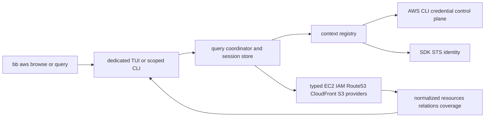

# AWS resource browser mini design

독자        저장소 소유자와 이후 구현자
목적        lazy read-only AWS TUI의 data flow, 화면, credential·정확성 경계를 고정한다
대상 환경   AWS CLI v2, AWS SDK for Go v2, 여러 profile, 선택 리전
최종 검토   2026-08-28
다음 검토   선택적 tmux/interactive resize 관찰 및 실계정 CloudTrail 승인 시
상태        구현·자동 Linux PTY·자동 release gate 완료, 수동/외부 acceptance 대기

`bb aws browse`는 전체 inventory snapshot을 먼저 만들지 않는다. 전용 Bubble Tea model이 local-only Home을 먼저 그리고, explicit open/search intent를 query coordinator에 전달해 필요한 SDK page만 progressive load한다. 이 문서는 과거 AWS CLI JSON preload와 공용 staged selector 설계를 supersede한다.

## 구조와 책임

- `internal/bb/aws_browse.go`: interactive-only browse grammar, terminal contract, runner entry.
- `internal/bb/aws_query.go`: exact scoped query grammar, JSON/human output, stable coverage/error shape.
- `internal/bb/awsbrowser/model.go`, `view.go`, `plain.go`: dedicated progressive UI, history, refresh, search, resize, plain fallback.
- `internal/bb/awsbrowser/query.go`, `store.go`, `registry.go`: dedupe, cancellation, successful-page retention, generation fencing, per-session cache.
- `internal/bb/awsbrowser/credentials.go`, `sdk.go`, `runtime_factory.go`: CLI credential bridge, endpoint restriction, STS identity, profile-scoped runtime.
- `internal/bb/awsbrowser/providers/*`: narrowed typed EC2/IAM/Route 53/CloudFront/S3 read interfaces and response normalization.
- `internal/bb/awsbrowser/integration/*`: production composition and bounded explicit-submit cross-profile search.

AWS CLI resource JSON is not a data path and there is no CLI fallback. CLI capability is restricted to profile discovery and credential export; SDK interfaces expose approved read operations only.

## Interaction contract

- Without `--profile`, the full-viewport context selector renders first and then performs bounded local profile/region/group discovery; Escape continues to ambient Home. With explicit `--profile`, Home renders before PATH lookup, profile discovery, credential export, STS, or resource call.
- `c` opens context selection from Home/list/detail. Opening performs local profile/region discovery and reads optional non-secret groups from `$XDG_CONFIG_HOME/bb/aws-contexts.json` or the OS user-config fallback (`~/.config/bb` on WSL/Linux); typing filters the loaded profile/group/region choices locally. Profile, current region, and `Current region`/`All <group> regions` scope are separate controls. Enter explicitly verifies only the current profile/region through credential export and STS, shows the derived account/principal, and a second Enter applies it and returns Home.
- Account is not free-form input: profile credentials determine account/principal. Region is editable before verification. Regional EC2/VPC catalog reads fan out current-first with concurrency two and per-region coverage when all scope is selected; IAM/Route 53/CloudFront stay single global reads. Every projected resource keeps its observed context, so linked detail reads pin one exact region. Failure keeps the previously active context and resource history; successful apply clears navigation history so later reads cannot inherit the prior context.
- Right/Enter opens the selected service, resource, category, or relation; Left returns one browser screen. Enter/open starts only the selected category/resource/relation request; unopened categories and tabs make zero calls.
- Resource selection opens Summary first: compact identity/status fields and relation, Detail, and Tags categories remain visible together. Detail is a separate local screen containing the full projected field set, scrolled with Up/Down or PageUp/PageDown. Right/Enter on a relation category such as Security groups or Volumes opens a locally filterable related-resource list; only Right/Enter on a resource in that list starts its read request. An exact linked lookup with one result replaces its transient list with Summary, while rule/record collections and multiple results retain a list. Security Group Summary provides direct Inbound rules and Outbound rules lists. IAM Role Summary provides direct Attached policies and Inline policies lists; policy rows are hydrated by exact GetPolicy/GetRolePolicy reads, and managed policy Summary opens its default Policy document. Hosted Zone Summary directly opens DNS records. A record Alias to the fixed AWS CloudFront alias zone traces directly to the exact distribution Summary; Origins then lists `Default /*` and every cache behavior path separately before an inferred S3 target is verified by `GetBucketLocation`. Structured IAM policy and Route 53 routing/alias values are pretty-printed in Detail.
- Loaded resource-list filtering is local across labels, IDs, status, projected fields, and tags; it does not dispatch provider work. AWS resource labels prefer a non-blank `Name` tag, then a native name such as an SG group name, and finally the ID; a separately chosen name retains the ID as secondary identity. Tags are removed from inline fields and open as a sorted, locally searchable key/value category. Cross-profile search editing is also local; Enter submits exact EC2/domain/role search with current or all scope.
- current context is scheduled first, other profiles are bounded, results stream with per-profile coverage and duplicate provenance.
- Left always pops one browser-history screen. Escape clears local input, closes an overlay, or pops history according to view state; Ctrl+C exits.
- At every supported size, the TUI uses the available viewport. Wider terminals reveal more identity and relation evidence columns, and taller terminals reveal more rows. Adaptive violet/cyan/green/amber/red roles distinguish focus, navigation, ready, read-only/loading, and failure states, while markers and labels preserve the same meaning under `NO_COLOR`.
- Refresh preserves the last stable projection until replacement completes and rejects late generations.
- Starting below 40x12 uses the plain loop before alt-screen; its `context` → `select <n> [region] [current|all]` path verifies and applies the same context contract. Shrinking during TUI keeps route/request state and shows resize/plain guidance.
- TUI writes to stderr, scoped query output writes to stdout, and non-TTY browse returns query guidance without AWS work.

## Credential and identity contract

Ambient and named contexts both resolve credentials through the AWS CLI bridge. Named child environments remove ambient identity and endpoint override variables; raw credential JSON is bounded, decoded in memory, and never logged. SDK STS verifies partition/account/principal, and each response is fenced by credential generation plus verified identity before store commit.

Custom endpoint environment/profile configuration is ignored for resource and credential requests in P0. `credential_process` execution remains the profile owner's trust boundary, but its returned credential material receives the same validation and memory-only handling.

## Read providers and relations

EC2 providers cover instances, volumes, security groups/rules, VPCs, subnets, and route tables. IAM providers cover roles, instance profiles, managed/inline policies, versions, and trust policy documents; the UI states that policy display is not effective-permission evaluation. Route 53 providers cover hosted zones and bounded record pagination. Only an API-exact Alias whose zone and DNS suffix identify AWS CloudFront becomes a narrowed CloudFront lookup; matching remains same-account because `ListDistributions` uses the selected verified runtime. CloudFront `TargetOriginId` mappings preserve each path-pattern condition. Standard S3 origin domains become inferred bucket links and `GetBucketLocation` supplies the terminal API verification. Unsupported external/custom targets remain evidence-only without inventing ownership.

Resource identity is `partition + account + region/global + type + id`; profile-specific observations remain separate. Exact ID/ARN relations and DNS evidence carry operation, reason, and observation time rather than collapsing different profile views into a synthetic resource.

## Failure and partial state

Errors are typed as empty, forbidden, auth-required, throttled, timed-out, cancelled, unsupported, or unknown. Completed pages remain usable after later page failure/cancellation; incomplete current pages do not enter cache. One profile failure does not erase another profile result, and `not found` is never inferred from `denied`, `login required`, or `not searched`.

## Verification status

Fixture/provider/query/model/golden coverage and production wiring implement the architecture without real credentials. Automated Linux PTY process checks, the skip-free guard, release CI test/vet/AWS-browser-race preflight, and all-four-target release-size checks pass and are committed. Optional direct tmux/interactive resize observation remains manual, and the owner-approved 12-profile real AWS latency/identity run plus CloudTrail review of credential/auth and STS/EC2/IAM/Route 53/CloudFront/S3 reads remains external acceptance; neither may be inferred from fake-client evidence.
