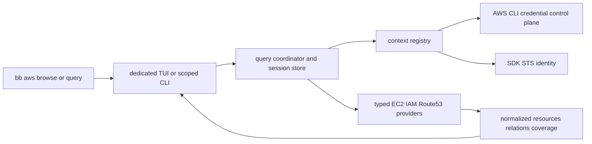

# AWS resource browser mini design

독자        저장소 소유자와 이후 구현자
목적        lazy read-only AWS TUI의 data flow, 화면, credential·정확성 경계를 고정한다
대상 환경   AWS CLI v2, AWS SDK for Go v2, 여러 profile, 선택 리전
최종 검토   2026-08-28
다음 검토   PTY/tmux·release·실계정 CloudTrail gate 완료 시
상태        core/provider/TUI/query와 production wiring 완료, 최종 acceptance 진행 중

`bb aws browse`는 전체 inventory snapshot을 먼저 만들지 않는다. 전용 Bubble Tea model이 local-only Home을 먼저 그리고, explicit open/search intent를 query coordinator에 전달해 필요한 SDK page만 progressive load한다. 이 문서는 과거 AWS CLI JSON preload와 공용 staged selector 설계를 supersede한다.

## 구조와 책임

- `internal/bb/aws_browse.go`: interactive-only browse grammar, terminal contract, runner entry.
- `internal/bb/aws_query.go`: exact scoped query grammar, JSON/human output, stable coverage/error shape.
- `internal/bb/awsbrowser/model.go`, `view.go`, `plain.go`: dedicated progressive UI, history, refresh, search, resize, plain fallback.
- `internal/bb/awsbrowser/query.go`, `store.go`, `registry.go`: dedupe, cancellation, successful-page retention, generation fencing, per-session cache.
- `internal/bb/awsbrowser/credentials.go`, `sdk.go`, `runtime_factory.go`: CLI credential bridge, endpoint restriction, STS identity, profile-scoped runtime.
- `internal/bb/awsbrowser/providers/*`: narrowed typed EC2/IAM/Route 53 read interfaces and response normalization.
- `internal/bb/awsbrowser/integration/*`: production composition and bounded explicit-submit cross-profile search.

AWS CLI resource JSON is not a data path and there is no CLI fallback. CLI capability is restricted to profile discovery and credential export; SDK interfaces expose approved read operations only.

## Interaction contract

- Home renders before PATH lookup, profile discovery, credential export, STS, or resource call.
- Enter/open starts only the selected category/resource/relation request; unopened categories and tabs make zero calls.
- Search editing is local; Enter submits exact EC2/domain/role search with current or all scope.
- current context is scheduled first, other profiles are bounded, results stream with per-profile coverage and duplicate provenance.
- Escape clears local input, closes an overlay, or pops history according to view state; Ctrl+C exits.
- Refresh preserves the last stable projection until replacement completes and rejects late generations.
- Starting below 40x12 uses the plain loop before alt-screen; shrinking during TUI keeps route/request state and shows resize/plain guidance.
- TUI writes to stderr, scoped query output writes to stdout, and non-TTY browse returns query guidance without AWS work.

## Credential and identity contract

Ambient and named contexts both resolve credentials through the AWS CLI bridge. Named child environments remove ambient identity and endpoint override variables; raw credential JSON is bounded, decoded in memory, and never logged. SDK STS verifies partition/account/principal, and each response is fenced by credential generation plus verified identity before store commit.

Custom endpoint environment/profile configuration is ignored for resource and credential requests in P0. `credential_process` execution remains the profile owner's trust boundary, but its returned credential material receives the same validation and memory-only handling.

## Read providers and relations

EC2 providers cover instances, volumes, security groups/rules, VPCs, subnets, and route tables. IAM providers cover roles, instance profiles, managed/inline policies, versions, and trust policy documents; the UI states that policy display is not effective-permission evaluation. Route 53 providers cover hosted zones and bounded record pagination, preserving exact record evidence and unsupported external targets without inventing ownership.

Resource identity is `partition + account + region/global + type + id`; profile-specific observations remain separate. Exact ID/ARN relations and DNS evidence carry operation, reason, and observation time rather than collapsing different profile views into a synthetic resource.

## Failure and partial state

Errors are typed as empty, forbidden, auth-required, throttled, timed-out, cancelled, unsupported, or unknown. Completed pages remain usable after later page failure/cancellation; incomplete current pages do not enter cache. One profile failure does not erase another profile result, and `not found` is never inferred from `denied`, `login required`, or `not searched`.

## Verification status

Fixture/provider/query/model/golden coverage and production wiring implement the architecture without real credentials. PTY/tmux/release gates are still being finalized, and the repository must not claim release readiness until they pass. The remaining real AWS gate requires owner-approved credentials and CloudTrail review of credential/auth plus STS/EC2/IAM/Route 53 read operations; it cannot be replaced by fake-client evidence.
