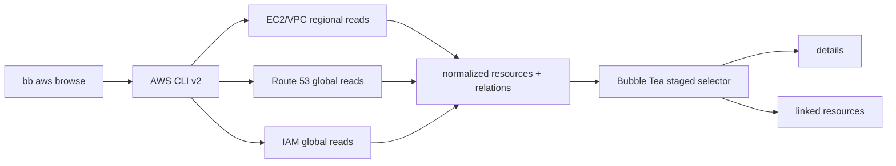

# AWS resource browser mini design

독자        저장소 소유자와 이후 구현자
목적        read-only AWS graph 수집·탐색 구조와 정확성 경계를 고정한다
대상 환경   개인 AWS 계정, AWS CLI v2, P0 단일 리전
최종 검토   2026-08-27
다음 검토   P0 실계정 smoke 완료 시
상태        P0 구현중

`bb aws browse`는 AWS CLI JSON 응답을 정규화한 메모리 그래프로 만든 뒤 기존 staged selector로 탐색한다. 리소스 변경 API와 credential 저장은 없다. P0의 핵심 트레이드오프는 TUI가 즉시 관계를 따라갈 수 있도록 시작 시 snapshot을 읽는 대신, 큰 계정에서 초기 지연이 생긴다는 점이다.

## 요구사항과 제약

### 요구사항

- EC2 상세에서 EBS, Security Group, VPC, Subnet으로 이동할 수 있어야 한다.
- 연결된 리소스 목록에서 다시 상세로 들어가고 Escape로 이전 위치에 돌아가야 한다.
- Route 53 zone/record를 검색하고, 확인 가능한 AWS 대상은 연결 정보를 제공해야 한다.
- IAM과 VPC는 최소 목록·상세 진입점을 제공해야 한다.
- 모든 AWS 호출은 조회 전용이어야 하며 부분 권한 실패를 허용해야 한다.

### 제약

- AWS CLI가 SSO login, profile, credential cache, API pagination을 소유한다.
- 기존 Bubble Tea staged selector는 provider fetch를 키 이벤트 안에서 실행할 수 없다.
- IAM/Route 53은 글로벌이고 EC2/EBS/SG/VPC는 리전 리소스다.
- Route 53 AliasTarget에는 대상 ARN이나 계정·리전이 없고 DNSName과 canonical hosted zone만 있다.
- 새 의존성은 추가하지 않는다.

## 가정

- P0 사용자는 한 번에 하나의 리전을 조사한다. 틀리면 전체 리전 탐색 요구가 초기 호출량과 화면 계층을 바꾼다.
- AWS CLI v2가 설치되어 있고 SSO/profile 인증이 끝나 있다. 틀리면 도구는 로그인 안내까지만 제공하고 inventory를 만들 수 없다.
- 인벤토리는 대부분 수백 리소스 이하다. 틀리면 시작 전 preload가 느려져 lazy loading이 필수가 된다.
- Route 53의 EC2 연결은 IP/DNS가 정확히 같은 경우만 후보로 제시해도 유용하다. 틀리면 ELB/CloudFront/API Gateway adapter가 P0에 필요하다.

## 현재 → 목표 → 차이

- 현재: `bb aws`는 SSO login과 profile credential 적용만 제공한다. AWS 리소스 조회와 관계 모델은 없다.
- 목표: `bb aws browse`가 계정·리전 문맥을 보여주며 네 개의 진입점(EC2, Route 53, IAM, VPC)에서 리소스 관계를 탐색한다.
- 차이: AWS CLI JSON reader, 서비스 응답 parser, normalized resource/relation graph, graph-to-stage adapter, partial failure contract가 추가된다.

## 목표 구조 — AWS CLI와 TUI 사이에 normalized graph를 둔다

이 그림에서 볼 것은 자격증명·페이지네이션은 AWS CLI에 남고 TUI는 정규화된 snapshot만 읽는다는 점이다.



## 컴포넌트별 책임

- `aws.go`: `browse` 서브커맨드 라우팅과 도움말.
- `aws_browse.go` option parser: profile/region/json 문법만 검증한다.
- AWS JSON reader: direct argv로 `aws <service> <operation> --output json --no-cli-pager`를 실행하고 stderr를 안전한 오류로 바꾼다.
- inventory collector: 서비스별 조회 실패를 warning으로 축적하고 성공한 응답은 계속 사용한다.
- graph builder: AWS 응답 타입을 `resource`, `field`, `relation(exact|heuristic)`으로 정규화한다.
- graph browser: Service → Resource → Details/Relation → Resource stage를 기존 `selectStages`로 만든다.
- `aws_browse_test.go`: fixture subprocess로 argv, 관계, partial result, JSON/non-TTY 계약을 검증한다.

## P0 API와 최소 조회 권한

P0는 다음 호출만 사용한다. AWS CLI는 list/describe 결과를 기본으로 자동 pagination한다.

```json
{
  "Version": "2012-10-17",
  "Statement": [
    {
      "Effect": "Allow",
      "Action": [
        "sts:GetCallerIdentity",
        "ec2:DescribeInstances",
        "ec2:DescribeVolumes",
        "ec2:DescribeSecurityGroups",
        "ec2:DescribeVpcs",
        "ec2:DescribeSubnets",
        "ec2:DescribeRouteTables",
        "route53:ListHostedZones",
        "route53:ListResourceRecordSets",
        "iam:ListUsers",
        "iam:ListRoles"
      ],
      "Resource": "*"
    }
  ]
}
```

검토 근거: [EC2 API operations](https://docs.aws.amazon.com/AWSEC2/latest/APIReference/API_Operations.html), [Route 53 API operations](https://docs.aws.amazon.com/Route53/latest/APIReference/API_Operations.html), [IAM API operations](https://docs.aws.amazon.com/IAM/latest/APIReference/API_Operations.html), [STS GetCallerIdentity](https://docs.aws.amazon.com/STS/latest/APIReference/API_GetCallerIdentity.html). AWS managed `ReadOnlyAccess`는 P0보다 넓으므로 이 명시적 action 목록을 사용한다.

## 관계와 정확도

- `exact`: AWS 응답의 resource ID/ARN으로 연결. EC2↔EBS, EC2↔SG, EC2↔VPC/Subnet, VPC↔자식 리소스가 해당한다.
- `heuristic`: Route 53 record value와 EC2 IP/DNS가 동일하거나 AliasTarget DNS suffix로 서비스를 추정한 경우다.
- `unsupported`: AliasTarget은 표시하되 대상 서비스 adapter가 없으면 DNS metadata 화면에서 멈춘다.

Route 53 A/AAAA가 EC2 public IP를 가리키는 것은 상관관계이지 Route 53이 EC2 소유 정보를 저장한 것이 아니다. AliasTarget도 ARN을 제공하지 않으므로 UI와 JSON에서 confidence를 숨기지 않는다. 근거: [AliasTarget API](https://docs.aws.amazon.com/Route53/latest/APIReference/API_AliasTarget.html), [Route 53에서 EC2로 라우팅](https://docs.aws.amazon.com/Route53/latest/DeveloperGuide/routing-to-ec2-instance.html).

## 실패 모드

- AWS CLI 없음: capability unavailable로 종료하며 설치 안내를 제공한다.
- SSO 만료/credential 오류: 각 조회 warning에 AWS CLI 오류를 남긴다. 모든 조회가 실패하면 로그인/profile 점검 안내와 함께 종료한다.
- 특정 서비스 AccessDenied: 성공한 서비스로 TUI/JSON을 만들고 warning 화면과 JSON warnings에 남긴다.
- Route 53 zone record 조회 일부 실패: 다른 zone과 서비스 결과는 유지한다.
- 큰 계정/느린 네트워크: TUI 진입 전 지연된다. P0에는 cache가 없으며 10초 반복 초과가 재설계 트리거다.
- 조회 중 AWS 상태 변경: API별로 시점이 조금 다른 snapshot이 된다. P0는 일관된 transaction을 보장하지 않는다.
- 해석 불가능 alias: 외부/미지원 target node로 표시하고 확정 링크처럼 보이지 않게 한다.

## 확장 한계와 재검토 트리거

- 리소스 1,000개 또는 시작 지연 10초를 넘으면 async lazy loading, context cancel, bounded cache를 도입한다.
- Route 53은 계정당 5 requests/s 제한이 있으므로 multi-region/zone fan-out 전에는 동시성 limiter를 추가한다. 근거: [Route 53 limits](https://docs.aws.amazon.com/Route53/latest/DeveloperGuide/DNSLimitations.html).
- SG의 EC2 외 사용처가 필요하면 `DescribeNetworkInterfaces`; Elastic IP 관계가 필요하면 `DescribeAddresses`를 추가한다.
- ELB/CloudFront/API Gateway alias 상세 이동은 각 서비스 adapter와 최소 권한을 별도 추가한다.
- 서비스 adapter가 10개를 넘으면 AWS CLI JSON 타입 유지 비용과 AWS SDK for Go v2 전환 비용을 ADR에서 비교한다.

## 운영 인계와 검증

- 관측할 영구 프로세스나 로컬 state는 없다. 실행 중 메모리 snapshot만 존재한다.
- 매 변경마다 fixture 기반 targeted test, `go test ./...`, `go vet ./...`, `go build ./cmd/bb`를 실행한다.
- 실계정 smoke는 read-only 정책을 연결한 profile로 실행하고 CloudTrail에서 예상한 List/Describe/Get 외 호출이 없는지 확인한다.
- 문서는 P0 smoke 완료, API action 변경, lazy loading 도입, SDK 전환 시 갱신한다.
## 미결 사항

- P1에서 먼저 추가할 resolver를 ELBv2와 ENI/EIP 중 어느 것으로 할지는 실제 점검 빈도로 결정한다.
- multi-region UI를 region-first로 할지 service-first로 할지는 단일 리전 사용 데이터를 본 뒤 결정한다.
